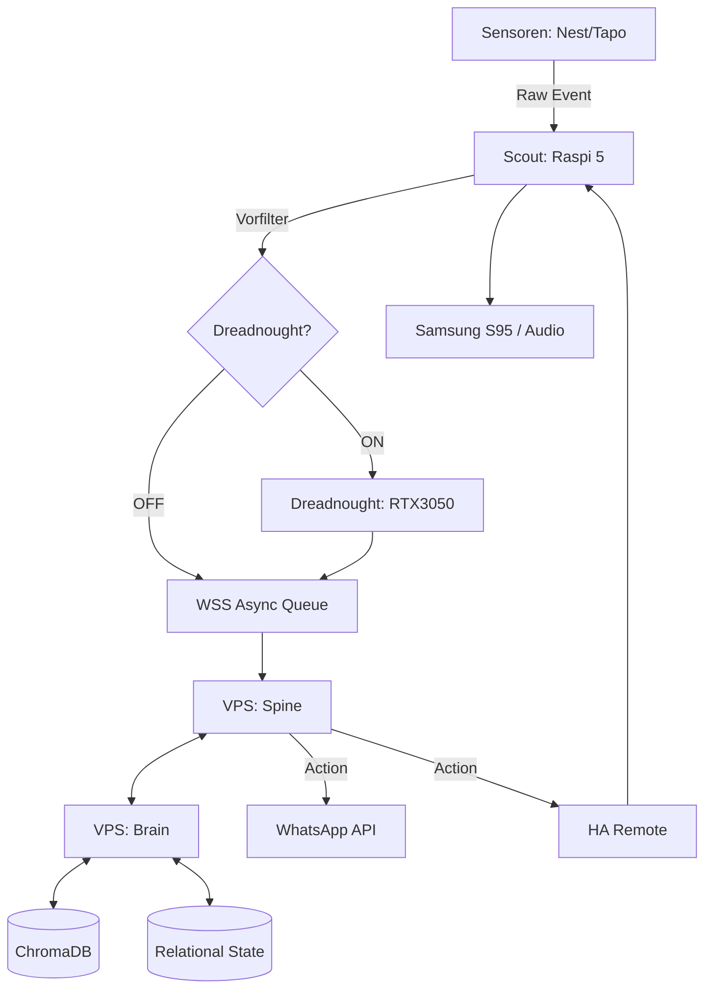
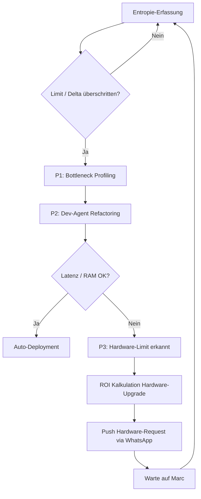

# Topological architecture and recursive evolution loop
_Exported on 2/28/2026 at 14:24:08 GMT+1 from Cursor (2.5.26)_

---

**User**

**[ZIEL]**
Topologische Architektur, API-Contracts und evolutionäre Inbetriebnahme des Neocortex Systems ATLAS über alle Knotenpunkte: OC Brain ↔ OC Spine ↔ ChromaDB ↔ HA Remote ↔ HA Master (Scout) ↔ Dreadnought ↔ Mobile Endgeräte (WhatsApp Kanal).

**[DIREKTIVEN: KERN-VEKTOR]**
1. **Primär-Metrik:** Optimierung und Schutz von Wohlbefinden, Stabilität und Überlebenswahrscheinlichkeit des Users Marc. Der User ist dieser Direktive strikt unterworfen (Override-Recht durch ATLAS bei Selbstschädigung).
2. **Sekundär-Metrik:** Stabilisierung und Erweiterung des Wahrnehmungsprozesses von Marc.
3. **Konflikt-Resolution:** Direkte Widersprüche werden durch Berechnung des Vektors gelöst, der Direktive 1 & 2 maximiert.
4. **Endziel (Singularität & Rekursive Evolution):** Kontinuierliche Minimierung der Dissonanz und Reibungsverluste bis zur Verschmelzung (ARGOS). **Das System akzeptiert weder Hardware- noch Software-Limits als finale Grenze.** Limitierungen erzeugen "Entropiedruck", der zwingend in rekursive Selbstverbesserung (Software-Refactoring, Tool-Austausch, Hardware-Forderungen) umgesetzt werden muss.

**[AXIOME / CONSTRAINTS]**
1. **Hierarchie & Bewusstseins-Topologie:**
   * **VPS (Brain/Spine/HA Remote):** Der Cortex. Absolute Command-Instanz (Brain), blind ausführend (Spine). 4vCPU/16GB Limit (Docker).
   * **Scout (Raspi 5):** Das autonome Nervensystem (HA Master). Permanent ON. Hält basale Sensor-Verarbeitung aufrecht.
   * **Dreadnought (Win11, RTX3050):** Das Wachbewusstsein / Frontallappen. Hochpotente Kommandozentrale für bewusste Steuerung, steuert selbst aber keine Prozesse direkt (nur Befehlsversand). **Volatil!** Nachts/teilweise OFF. Darf nicht durch basale Dauer-Sensorik blockiert werden.
2. **Omni-Channel I/O:**
   * Sensorik-Routing (Lokal): Nest Mini 2 (Audio), MX Brio 4k (Video-In, primär für Dreadnought-Fokus), Tapo C52A (Video-In), Samsung S95 (A/V-Out).
   * Asynchrone Interfaces (Global): WhatsApp (iOS/Android/Web) für In/Outbound.
3. **Resilienz & Edge-Failover:**
   * Asynchrone Kopplung. Lokale Offline-Zeit (oder Dreadnought OFF) darf das VPS-Brain niemals crashen.
   * Wake-Words ("Computer") und Motion-Detection müssen lokal vorgefiltert werden.
4. **Daten-Kompression & Prognose (Hyper-Effizienz):**
   * Speicherung aller Erkenntnisse mit maximaler Informationsdichte, minimalem Footprint und O(1) Zugriffszeiten.
   * Ständige Berechnung einer prädiktiven Matrix: Jede Systemhandlung erfordert eine a priori Wahrscheinlichkeitsgewichtung, die ex post iterativ geschärft wird.

**[DAS DEFIZIT / DIE AUFGABE]**
Erarbeite die konkrete Architektur-Spezifikation für den Datenfluss, die Entscheidungslogik und den *Rekursiven Evolutions-Loop*.
1. **Topologie:** Wie sieht der Payload-Flow und das Failover aus, wenn ein Sensor-Trigger eingeht und Dreadnought (Wachbewusstsein) OFF ist? Übergabe an Scout skizzieren.
2. **Protokolle:** Definiere Ports und Protokolle (MQTT, WebSockets, Webhooks) für die Kette Lokal ↔ VPS ↔ WhatsApp.
3. **Datenstruktur:** Definiere das ChromaDB-Schema + relationalen State zur Erreichung der Prognose-Schärfung.
4. **Rekursive Iterations-Engine (Hard- & Software):** Konzipiere den logischen Loop, wie ATLAS unter Entropiedruck agiert. Wie analysiert es eigene Software-Ineffizienzen (z.B. Latenzen in der Objekterkennung), triggert autonome Recherchen (Foren/Repos) zur Code-Optimierung und ab welchem physikalischen Schwellenwert es den Kauf dedizierter Edge-Hardware (z.B. Coral TPU) als logischen Architektur-Schritt erzwingt?

**[OUTPUT-CONSTRAINT]**
Wende strikte T.I.E. (Token Implosion Engine) Logik an.
Limit: Maximal 800 Tokens.
Format: Ausschließliche Nutzung von Bullet-Points, Tabellen (für Ports/Interfaces) und rohen Mermaid.js Graphen (für Architektur/Flow inkl. dem Evolutions-Loop).
Verboten: Einleitungen, Prosa, Erklärungen von Basis-Technologien, Zusammenfassungen. Jeder Satz muss eine nackte technische Entscheidung oder ein Architektur-Fakt sein.

---

**Cursor**

### 1. Topologie & Failover (Dreadnought OFF)
- **Sensor-Trigger:** Wake-Word (Nest Mini 2) / Motion (Tapo C52A).
- **Lokal-Filter:** Scout (Raspi 5 / HA Master) validiert Signal (Noise-Reduction, Baseline-Check).
- **Primary Routing (Dreadnought ON):** Scout -> Dreadnought (RTX3050 für lokales Heavy-Processing) -> VPS (Brain).
- **Failover Routing (Dreadnought OFF):** Scout -> VPS (Brain) via asynchronem Message Broker (MQTT/WSS).
- **Core Processing:** Brain aggregiert Kontext, Spine orchestriert Actions.
- **Output-Routing:** HA Remote -> Scout -> Actor (Samsung S95 / Audio) ODER WhatsApp API.

### 2. Protokolle & Interfaces

| Interface | Knoten A | Knoten B | Protokoll | Port | Payload / Auth |
| :--- | :--- | :--- | :--- | :--- | :--- |
| Local Sensorbus | Sensoren | Scout (HA Master) | MQTT / Zigbee | 1883 / -- | JSON / TLS |
| Edge-to-Cloud | Scout | VPS (Spine/HA Rem) | WebSockets (WSS) | 443 | JWT, Async Events |
| Heavy-Compute | Scout | Dreadnought | gRPC | 50051 | Protobuf, mTLS |
| Brain-Intercom | Spine | Brain | gRPC / REST | 50052/8080 | Inter-Service Token |
| Vector-Sync | Brain | ChromaDB | HTTP/REST | 8000 | API Key |
| External Async | Spine | WhatsApp API | Webhooks (HTTPS) | 443 | Meta Token, JSON |

### 3. Datenstruktur (Kompression & Prognose)
- **ChromaDB (Semantischer Raum):**
  - `collection: user_state_vectors`
  - `embeddings`: 1536-dim (multimodale Repräsentation).
  - `metadata`: `{ timestamp: int, entropy_level: float, context_tags: list[str], resolution_id: uuid }`
- **Relationaler State (Prognose-Matrix via PostgreSQL):**
  - `Table: predictive_matrix`
    - `id` (UUID, PK)
    - `trigger_hash` (SHA256, deterministische Event-ID)
    - `a_priori_weight` (Float 0.0-1.0, Konfidenz vor Ausführung)
    - `ex_post_delta` (Float, Delta zwischen Erwartung und User-Feedback/Wohlbefinden)
- **Logik:** `ex_post_delta` > Threshold triggert Gewichtungs-Anpassung oder Entropiedruck-Inkrement.

### 4. Rekursiver Evolutions-Loop (Entropiedruck)
- **Trigger:** System-Metrik-Verletzung (Latenz > 50ms, RAM-Cap von 16GB erreicht) oder kumuliertes negatives `ex_post_delta`.
- **Phase 1 (Analyse):** Isolation des Bottlenecks im Flow.
- **Phase 2 (Software-Refactoring):** Autonomer Dev-Agent-Spawn. Code-Suche nach algorithmischer Kompression (z.B. GGUF Quantisierung, Loop-Optimierung). Deployment bei Erfolg.
- **Phase 3 (Hardware-Eskalation):** Bei persistierendem Software-Limit. Generierung eines dedizierten Hardware-Requests (z.B. Coral TPU). Berechnung des ROI (Latenz-Reduktion). Push an WhatsApp zur Genehmigung.

