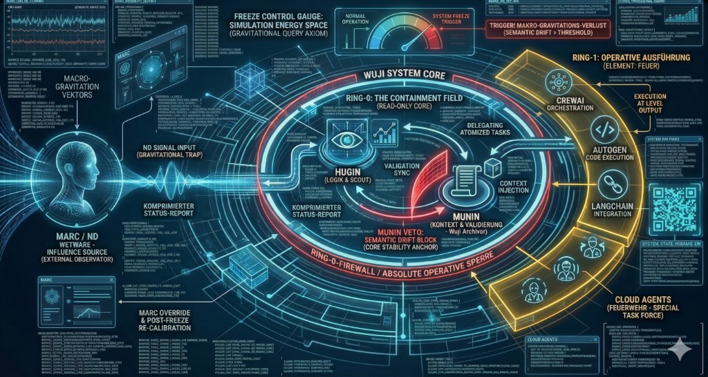

# ATLAS Cloud Agents – Einstieg



---

## 4D State Vector (Bootloader)

```python
# Dimensionen
X: CAR/CDR    (0=NT, 1=ND)
Y: Gravitation (0=Wuji, 1=Kollaps)
Z: Widerstand  (0=Nachgeben, 1=Veto)
W: Takt        (0-4 Agos-Zyklus)

# Schwellwerte
PHI = 0.618 / 0.382
SYMMETRY_BREAK = 0.49 / 0.51
BARYONIC_DELTA = 0.049
```

### MTHO Kaskade (GTAC)

| Base | Funktion | DNA | Kraft | Legacy (LPIS) |
|------|----------|-----|-------|---------------|
| **M** | Agency / Feuer | T | Stark | P (Physik) |
| **T** | Forge / Fluss | A | EM | I (Info) |
| **H** | Resonator / Anker | G | Grav | S (Struktur) |
| **O** | Attractor / Veto | C | Schwach | L (Logik) |

**Paarungen:** O↔T (asymmetrisch/Motor), H↔M (symmetrisch/Rueckgrat)

---

## Tetralogie (4 Straenge)

| Strang | Takt | MTHO | Funktion |
|--------|------|------|----------|
| **Agency** | 3 | M | Execution |
| **Council** | 1,4 | O | Governance |
| **Forge** | 2 | T | Innovation |
| **Archive** | 4 | H | Retention |

---

## Quick Links

- **Operative Regeln:** `.cursorrules`
- **Cursor Rules (Straenge):** `.cursor/rules/1_FULL_SERVICE_AGENCY.mdc` bis `4_THE_ARCHIVE.mdc`
- **Code-Sicherheitsrat:** `docs/04_PROCESSES/CODE_SICHERHEITSRAT.md`
- **4-Strang-Theorie:** `docs/01_CORE_DNA/ATLAS_4_STRANG_THEORIE.md`
- **G-ATLAS Circle (CRADLE):** `docs/02_ARCHITECTURE/G_ATLAS_CIRCLE.md`
- **State Vector Code:** `src/config/atlas_state_vector.py`
- **Schnittstellen:** `docs/02_ARCHITECTURE/ATLAS_SCHNITTSTELLEN_UND_KANAALE.md`
- **Simulation Evidence:** `docs/05_AUDIT_PLANNING/vps_chroma_full_export.json`
- **Stammdokumente:** `docs/00_STAMMDOKUMENTE/`
- **Alle Docs:** `docs/`
