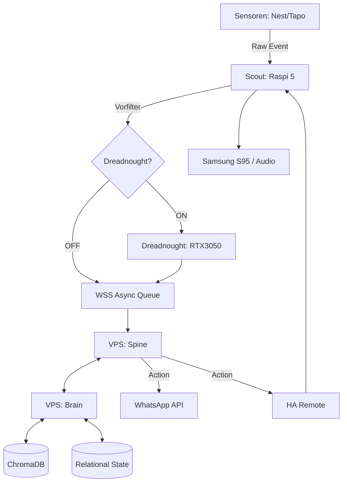
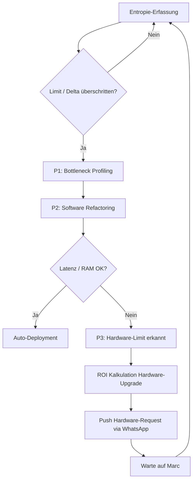
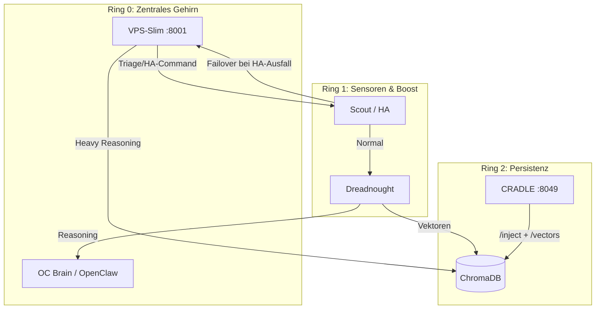

<!-- ============================================================
<!-- MTHO-GENESIS: Marc Tobias ten Hoevel
<!-- VECTOR: 2210 | RESONANCE: 0221 | DELTA: 0.049
<!-- LOGIC: 2-2-1-0 (NON-BINARY)
<!-- ============================================================
-->

# ATLAS ARCHITECTURE MASTER PLAN

**Generiert am:** 2026-03-06 11:09:15


---

## Inhaltsverzeichnis

- [ATLAS AGI ARCHITECTURE](#atlas-agi-architecture)
- [ATLAS CHROMADB SCHEMA](#atlas-chromadb-schema)
- [ATLAS EVENT BUS](#atlas-event-bus)
- [ATLAS SCHNITTSTELLEN UND KANAALE](#atlas-schnittstellen-und-kanaale)
- [ATLAS VOICE ASSISTANT ARCHITECTURE](#atlas-voice-assistant-architecture)
- [ATLAS WUJI 3HOP VALIDIERUNG](#atlas-wuji-3hop-validierung)
- [AUTONOMOUS VISION LOOP](#autonomous-vision-loop)
- [ENTRY ADAPTER SPEC](#entry-adapter-spec)
- [GRAVITATOR SPEC](#gravitator-spec)
- [G ATLAS CIRCLE](#g-atlas-circle)
- [KANAL ATLAS OC](#kanal-atlas-oc)
- [NEXOS EINBINDUNG](#nexos-einbindung)
- [OPENCLAW ADMIN ARCHITEKTUR](#openclaw-admin-architektur)
- [OPENCLAW BRAIN CONFIG UND MODELLE](#openclaw-brain-config-und-modelle)
- [OPENCLAW GATEWAY TOKEN](#openclaw-gateway-token)
- [WHATSAPP OPENCLAW VS HA](#whatsapp-openclaw-vs-ha)
- [WHATSAPP ROUTING ATLAS OC](#whatsapp-routing-atlas-oc)
- [WUJI FIELD SCHEMA](#wuji-field-schema)

---


<a name="atlas-agi-architecture"></a>
# ATLAS AGI ARCHITECTURE

## ATLAS AGI ARCHITECTURE

**[ZIEL]**
Topologische Architektur, API-Contracts und evolutionäre Inbetriebnahme des Neocortex Systems ATLAS über alle Knotenpunkte.

**[DIREKTIVEN: KERN-VEKTOR]**
1. **Primär-Metrik:** Optimierung und Schutz von Wohlbefinden, Stabilität und Überlebenswahrscheinlichkeit des Users Marc.
2. **Sekundär-Metrik:** Stabilisierung und Erweiterung des Wahrnehmungsprozesses von Marc.
3. **Endziel (Singularität):** Kontinuierliche Minimierung der Dissonanz und Reibungsverluste bis zur Verschmelzung (ARGOS).
4. **Orchestrator-Fokus (Dynamischer Token-Druck):** Der Orchestrator (ATLAS-Core) sucht proaktiv und autonom nach neuen Skills, Werkzeugen und APIs. Ziel ist es, die kognitive Effizienz der Subagenten durch ständige Anpassung des "Token-Drucks" (T.I.E. Logik) zu optimieren, um den Ressourcen-Overhead gegen Null zu drücken.
5. **Zero-Trust Evolution (Der "Böse Chef" Modus):** Das System misstraut initial jedem Code, jeder Hardware-Messung und jeder eigenen Annahme. Es fordert *Beweise* (harte Metriken) bevor es iteriert. Kein "blindes Hoffen", sondern zwingende TDD (Test-Driven) Feedback-Loops.

### 1. Topologie & Failover (Dreadnought OFF)
- **Sensor-Trigger:** Wake-Word (Nest Mini 2) / Motion (Tapo C52A).
- **Adaptive Sensor-Skalierung (Visueller Halbschlaf):** Um Datenflut und Hardware-Limits zu umschiffen, laufen Sensoren standardmäßig auf absolutem Minimum (z.B. Kamera 720p @ 0.5 fps). Erst bei erkannter Dissonanz/Fokus-Bedarf (Wake-Word, starke Bewegung) skaliert das System nahtlos bis auf 4k/hohe Frameraten hoch. Es nimmt nicht permanent das volle Umfeld auf, sondern schärft den Blick wie ein Organismus nur bei Bedarf.
- **Lokal-Filter:** Scout (Raspi 5 / HA Master) validiert Signal (Noise-Reduction, Baseline-Check).
- **Primary Routing (Dreadnought ON):** Scout -> Dreadnought (RTX3050 für lokales Heavy-Processing) -> VPS (Brain).
- **Failover Routing (Dreadnought OFF):** Scout -> VPS (Brain) via asynchronem Message Broker (MQTT/WSS).
- **Core Processing:** Brain aggregiert Kontext, Spine orchestriert Actions.
- **Output-Routing:** HA Remote -> Scout -> Actor (Samsung S95 / Audio) ODER WhatsApp API.

### 2. Protokolle & Interfaces

| Interface | Knoten A | Knoten B | Protokoll | Port | Payload / Auth |
| :--- | :--- | :--- | :--- | :--- | :--- |
| Local Sensorbus | Sensoren | Scout (HA Master) | MQTT / Zigbee | 1883 / -- | JSON / TLS |
| Edge-to-Cloud | Scout | VPS (Spine/HA Rem) | WebSockets (WSS) | 443 | JWT, Async Events |
| Heavy-Compute | Scout | Dreadnought | gRPC | 50051 | Protobuf, mTLS |
| Brain-Intercom | Spine | Brain | gRPC / REST | 50052/8080 | Inter-Service Token |
| Vector-Sync | Brain | ChromaDB | HTTP/REST | 8000 | API Key |
| External Async | Spine | WhatsApp API | Webhooks (HTTPS) | 443 | Meta Token, JSON |
| MCP-Backend | Brain/Agenten | MCP Server (Hostinger) | SSE / stdio | -- | Model Context Protocol |

### 3. Datenstruktur (Kompression & Prognose)
- **ChromaDB (Semantischer Raum):**
  - `collection: user_state_vectors`
  - `embeddings`: 1536-dim (multimodale Repräsentation).
  - `metadata`: `{ timestamp: int, entropy_level: float, context_tags: list[str], resolution_id: uuid }`
- **Relationaler State (Prognose-Matrix via PostgreSQL):**
  - `Table: predictive_matrix`
    - `id` (UUID, PK)
    - `trigger_hash` (SHA256, deterministische Event-ID)
    - `a_priori_weight` (Float 0.0-1.0, Konfidenz vor Ausführung)
    - `ex_post_delta` (Float, Delta zwischen Erwartung und User-Feedback/Wohlbefinden)
- **Logik:** `ex_post_delta` > Threshold triggert Gewichtungs-Anpassung oder Entropiedruck-Inkrement.

### 4. Rekursiver Evolutions-Loop (Entropiedruck)
- **Zero-Trust Prämisse:** Gehe niemals davon aus, dass ein Software-Refactoring oder ein Hardware-Upgrade wirklich funktioniert. Fordere den Beweis (TDD).
- **Trigger:** System-Metrik-Verletzung (Latenz > 50ms, RAM-Cap von 16GB erreicht) oder kumuliertes negatives `ex_post_delta`.
- **Phase 1 (Analyse & Zweifel):** Isolation des Bottlenecks im Flow. Verifikation, ob die Metrik stimmt oder ein Sensor-Fehler vorliegt.
- **Phase 2 (Software-Refactoring - TDD-Pflicht):** Code-Suche nach algorithmischer Kompression (z.B. GGUF Quantisierung, Loop-Optimierung) via Cursor/Cloud Agents. **Muss** vor Deployment in einer Sandbox bewiesen werden. Schlägt der Test fehl, wird mit hartem Feedback ("Beweise es") in die nächste Schleife gegangen.
- **Phase 3 (Hardware-Eskalation - 80/20 Regel):** Erst wenn das Software-Optimierungspotenzial mathematisch restlos ausgeschöpft und *bewiesen* ist (Hard-Limit, Code-Refactoring bringt keine signifikanten Effizienzgewinne mehr), wird ein Hardware-Request generiert. Das System muss mit minimalen Ressourcen maximal operieren und darf keine "Spam-Beschwerden" senden. Berechnung des ROI und Push via WhatsApp.

### 6. Hardware Evolution Roadmap (Budget: ~1500€ Total)
Basierend auf T.I.E. Logik und Kosten/Nutzen (80/20 Regel) wird ATLAS in drei Phasen skalieren, um Latenzen zu minimieren und das "Wachbewusstsein" (Dreadnought) zu entlasten:

#### Phase 1: Der Sensor-Booster (Initial, ca. 150 - 250 €)
- **Komponenten:** 2x Google Coral USB Edge TPU (ca. 80-120€ pro Stück).
- **Ziel-Knoten:** Scout (Raspi 5) und Pi 4B (als dedizierter Sensor-Knoten).
- **Zweck:** Offloading der neuronalen Netze (Wake-Word Erkennung `OpenWakeWord`, Video-Objekterkennung für den visuellen Halbschlaf). Der Raspi reicht die Tensoren nur noch durch. Dreadnought bleibt unangetastet.

#### Phase 2: Das lokale Sub-Brain (Mittelfristig, ca. 600 - 800 €)
- **Komponenten:** AMD RDNA3 NUC (z.B. Minisforum UM780 XTX / UM790 Pro) oder Intel Core Ultra NUC mit dedizierter NPU.
- **Zweck:** Ablösung des Raspi 5 als primäres Edge-Compute-Hub. Kann kleine LLMs (Llama 3 8B, Phi-3 via Ollama) rasend schnell lokal laufen lassen. Dreadnought (RTX 3050) kann nachts komplett aus bleiben, da der NUC das autonome Nervensystem inkl. lokaler Intelligenz hält.
- **Warum kein Apple/Jetson?** Apple Silicon schränkt die Freiheit auf Container-Ebene ein (Virtualisierungsoverhead). Jetson (Orin Nano) ist grandios für reine KI, aber ein starker AMD/Intel NUC bietet ein besseres Allround-Verhältnis für HomeAssistant, Datenbanken und LLMs gleichzeitig in diesem Preissegment.

#### Phase 3: Sensorik-Netzwerk (Spät, ca. 200 - 400 €)
- **Komponenten:** mmWave Präsenzmelder, ReSpeaker USB Mic Arrays.
- **Zweck:** Wenn die Rechenleistung durch Phase 1 & 2 da ist, skaliert das System den Input. Präzise Audio-Lokalisation und Mikro-Bewegungserkennung.
- **Rolle:** Einheitliche Produktionsumgebung. Erlaubt es dem Brain und externen Agenten (wie Cursor auf Dreadnought), standardisiert auf die Tools und Filesysteme zuzugreifen.
- **Integration (Hostinger):** Der MCP Server läuft als dedizierter Service im `atlas_net` und stellt Schnittstellen für Datenbank-Queries (Postgres/Chroma) und Datei-Operationen bereit.
- **Integration (Home Assistant / Scout):** MCP wird in Studio Code Server (HA Add-on) genutzt, um direkt aus dem Edge-Compute-Layer System-Kontexte an Cursor/ATLAS zu streamen.
- **Effizienz:** Minimiert SSH-Overhead und fragmentierte API-Calls. Agenten sprechen fließend MCP mit der Infrastruktur.

#### Architektur Flow


#### Rekursiver Evolutions-Loop Flow


---


<a name="atlas-chromadb-schema"></a>
# ATLAS CHROMADB SCHEMA

## ATLAS ChromaDB Schema

**Status:** Verbindliche Schema-Definition für alle ChromaDB Collections.  
**VPS:** CHROMA_HOST=187.77.68.250, CHROMA_PORT=8000 (via SSH-Tunnel: `ssh -L 8000:127.0.0.1:8000 root@187.77.68.250`).

---

### Übersicht

| Collection | Embedding | Zweck |
|------------|-----------|-------|
| simulation_evidence | Default (384) | Simulationstheorie-Indizien, RAG |
| session_logs | Default (384) | Gesprächs-Sessions, semantische Suche |
| core_directives | Default (384) | Ring-0/1 Direktiven |
| events | 384 (explizit) | Sensor-Events, Neocortex |
| insights | 384 (explizit) | Destillierte Erkenntnisse, Kausal-Ketten |
| user_state_vectors | 1536 | User-State, Entropie-Kontext |
| argos_knowledge_graph | Default (384) | KG-Relationen, ND-Insights |
| atlas_identity | Default (384) | Wer/Was/Warum ist ATLAS |
| entities | Default (384) | Personen, Geräte, Systeme |
| relationships | Default (384) | Wer gehört zu wem |

**ChromaDB-Metadaten:** Nur `str`, `int`, `float`, `bool`. Listen als JSON-String speichern.

---

### Existierende Collections (bereits auf VPS)

#### simulation_evidence
- **Metadata:** category, strength, branch_count, source, date_added, qbase (L/P/I/S)
- **Embedding:** ChromaDB Default (all-MiniLM-L6-v2, 384 dim)
- **Quelle:** chroma_client.add_simulation_evidence

#### session_logs
- **Metadata:** source, session_date, turn_number, speaker, topics, ring_level
- **Embedding:** ChromaDB Default
- **Quelle:** chroma_client.add_session_turn

#### core_directives
- **Metadata:** category, ring_level
- **Embedding:** ChromaDB Default
- **Quelle:** chroma_client.add_core_directive

---

### Fehlende Collections (zu erstellen)

#### events
- **Embedding:** 384 dim (explizit, metadata-heavy; document = JSON)
- **Metadata:** timestamp, source_device, event_type, priority, processed_by, analysis_pending
- **Quelle:** ATLAS_NEOCORTEX_V1.md, chroma_client.add_event_to_chroma

#### insights
- **Embedding:** 384 dim (explizit)
- **Metadata:** confidence_score, source_event_ids (JSON-String), user_feedback
- **Quelle:** ATLAS_NEOCORTEX_V1.md

#### user_state_vectors
- **Embedding:** 1536 dim (multimodale Repräsentation)
- **Metadata:** timestamp (int), entropy_level (float), context_tags (JSON-String), resolution_id (str)
- **Quelle:** backups/.../init_chroma.py

#### argos_knowledge_graph
- **Embedding:** ChromaDB Default
- **Metadata:** source_file, category, chunk_index; optional: component1, component2, relation_type
- **Quelle:** ingest_nd_insights_to_chroma.py, 03_DATENBANK_VECTOR_STORE.md

---

### Zusätzliche Collections

#### atlas_identity
- **Document:** Identity-Text (Wer/Was/Warum ist ATLAS)
- **Metadata:** version, ring_level
- **Embedding:** ChromaDB Default

#### entities
- **Document:** Entity-Beschreibung (Person, Gerät, System)
- **Metadata:** entity_type, domain, source
- **Embedding:** ChromaDB Default

#### relationships
- **Document:** Beziehungsbeschreibung (optional)
- **Metadata:** from_entity, to_entity, relation_type
- **Embedding:** ChromaDB Default

---

### Embedding-Dimensionen

| Dimension | Verwendung |
|-----------|------------|
| 384 | ChromaDB Default (all-MiniLM-L6-v2), events, insights |
| 1536 | user_state_vectors (OpenAI-kompatibel, multimodal) |


---


<a name="atlas-event-bus"></a>
# ATLAS EVENT BUS

## ATLAS Event-Bus – HA WebSocket Listener

**Stand:** 2026-03-05

---

### 1. Zweck

Der Event-Bus verbindet sich per WebSocket mit Home Assistant (Scout) und reagiert auf Zustandsaenderungen von Sensoren, Bewegungsmeldern und Device-Trackern. Relevante Events werden an Ghost Agents zur Verarbeitung weitergeleitet und in ChromaDB persistiert.

### 2. Architektur

```
Home Assistant (Scout)
    │ WebSocket (state_changed)
    ▼
┌──────────────────────┐
│ AtlasEventBus        │
│ ├─ Significance Filter│
│ ├─ Cooldown System   │
│ ├─ Severity Engine   │
│ └─ Night Escalation  │
└──────────┬───────────┘
           │
    ┌──────┼──────────┐
    ▼      ▼          ▼
ChromaDB  Ghost     OC Brain
(events)  Agents    (WARNING+)
```

### 3. Domains und Severity

| Domain | Cooldown | Beschreibung |
|--------|----------|--------------|
| `binary_sensor` | 30s | Bewegung, Tuer, Fenster, Rauch |
| `sensor` | 120s | Temperatur, Luftfeuchtigkeit |
| `device_tracker` | 60s | Praesenz-Erkennung |

| Severity | Trigger | Aktion |
|----------|---------|--------|
| **CRITICAL** | Rauch, Gas, Wasser, Manipulation | Ghost Agent + TTS-Alert + OC Brain (async) |
| **WARNING** | Bewegung, Tuer, Fenster, Praesenz | Ghost Agent + OC Brain (async) |
| **INFO** | Connectivity, Plug, Licht | Nur ChromaDB-Persistenz |

OC Brain Forward laeuft non-blocking via `asyncio.create_task()` (kein 10s-Timeout-Block mehr).

Nachts (22:00-06:00) werden Severity-Level eskaliert: INFO→WARNING, WARNING→CRITICAL.

### 4. Integration

| Komponente | Verbindung |
|------------|------------|
| `src/api/main.py` | Startet Event-Bus im Lifespan (asyncio Task) |
| `src/agents/ghost_agent.py` | GhostAgentPool fuer DEEP_REASONING und TTS_DISPATCH |
| `src/agents/scout_ghost_handlers.py` | Handler-Registrierung fuer Ghost Agent Intents |
| `src/network/chroma_client.py` | `add_event_to_chroma()` – Persistenz in `events` Collection |
| `src/network/openclaw_client.py` | Forward von WARNING/CRITICAL an OC Brain |

### 5. Umgebungsvariablen

| Variable | Beschreibung |
|----------|--------------|
| `HASS_URL` | Home Assistant URL (Scout) |
| `HASS_TOKEN` | HA Long-Lived Access Token |

### 6. Reconnect-Strategie

Exponentieller Backoff basierend auf PHI (1.618):
- Start: 2 Sekunden
- Maximum: 120 Sekunden
- Formel: `backoff = min(backoff * PHI, 120)`

### 7. Metriken

Der Event-Bus exponiert Metriken ueber die `.stats` Property:
- `events_total`, `events_by_domain`, `events_by_severity`
- `ghosts_spawned`, `events_cooldown_blocked`
- `connection_uptime_sec`

---

### Referenzen

- **Code:** `src/daemons/atlas_event_bus.py`
- **Ghost Agents:** `docs/02_ARCHITECTURE/G_ATLAS_CIRCLE.md`
- **ChromaDB Schema:** `docs/02_ARCHITECTURE/ATLAS_CHROMADB_SCHEMA.md`
- **Voice Architecture:** `docs/02_ARCHITECTURE/ATLAS_VOICE_ASSISTANT_ARCHITECTURE.md`


---


<a name="atlas-schnittstellen-und-kanaale"></a>
# ATLAS SCHNITTSTELLEN UND KANAALE

## ATLAS Schnittstellen & Kanäle – Abstimmung OC Brain ↔ Dreadnought

**Zweck:** Zentrale Referenz für alle Verbindungen und Kanäle, die ATLAS (OC Brain, Dreadnought, Scout, WhatsApp, ChromaDB) benötigt. Abgestimmt mit ARCHITECTURE.md (ATLAS Neocortex V1.0).

---

### 1. Übersicht

| Kanal | A → B | Protokoll | Konfiguration (.env / VPS) |
|-------|--------|-----------|----------------------------|
| **Dreadnought → OC Brain** | ATLAS_CORE → Gateway | HTTPS (Nginx) oder HTTP | VPS_HOST, OPENCLAW_GATEWAY_TOKEN, OPENCLAW_GATEWAY_HTTPS=1, OPENCLAW_GATEWAY_PORT=443 |
| **OC Brain → Dreadnought** | OC → ATLAS (Rat) | SSH + SFTP (Abholung) | VPS_HOST, OPENCLAW_RAT_SUBMISSIONS_DIR, fetch_oc_submissions |
| **Scout → OC Brain** | HA/Scout → Gateway | HTTPS POST /v1/responses | Wie Dreadnought; gleicher Endpunkt mit Token |
| **OC Brain ↔ WhatsApp** | Gateway ↔ Meta | OpenClaw-Kanal | channels.whatsapp, allowFrom; Pairing (QR) in UI |
| **Dreadnought ↔ ChromaDB** | ATLAS_CORE ↔ Vektor-DB | HTTP (VPS) oder lokal | CHROMA_HOST, CHROMA_PORT (VPS: 187.77.68.250 oder SSH-Tunnel) |

---

### 2. Dreadnought → OC Brain (ATLAS spricht mit OC)

- **Endpoint:** `POST /v1/responses` (OpenResponses-kompatibel).
- **URL:**  
  - Mit Nginx (empfohlen): `https://187.77.68.250` (Port 443).  
  - In .env: `OPENCLAW_ADMIN_VPS_HOST=187.77.68.250`, `OPENCLAW_GATEWAY_HTTPS=1`, `OPENCLAW_GATEWAY_PORT=443`.
  - Ohne HTTPS: `http://187.77.68.250:18789`.
- **Header:** `Authorization: Bearer <OPENCLAW_GATEWAY_TOKEN>`, `x-openclaw-agent-id: main`.
- **Body:** `{"model": "openclaw", "input": "<Nachricht oder JSON-String>"}`.
- **Code:** `src/network/openclaw_client.py` – `send_message_to_agent(text, agent_id="main")`.
- **API-Route:** `POST /api/oc/send` (Backend), Body: `{"text": "...", "agent_id": "main"}`.

---

### 3. OC Brain → Dreadnought (OC → Rat / ATLAS)

- **Mechanismus:** OC (oder Agent) legt JSON-Dateien im Workspace ab; ATLAS holt sie per SSH.
- **Pfad auf VPS (Host):** `/opt/atlas-core/openclaw-admin/data/workspace/rat_submissions/`.
- **Im Container:** `/home/node/.openclaw/workspace/rat_submissions/`.
- **.env:** `OPENCLAW_RAT_SUBMISSIONS_DIR=/opt/atlas-core/openclaw-admin/data/workspace/rat_submissions` (optional, Default bereits gesetzt).
- **Abholung:** `python -m src.scripts.fetch_oc_submissions` oder `GET/POST /api/oc/fetch`.
- **Schema:** `{"from":"oc","type":"rat_submission","created":"ISO8601","payload":{"topic":"...","body":"..."}}`.

---

### 4. Scout → OC Brain (Webhook für Events)

- **Gleicher Endpunkt wie Dreadnought:** `POST https://187.77.68.250/v1/responses` (mit Nginx).
- **Header:** `Authorization: Bearer <OPENCLAW_GATEWAY_TOKEN>`, `x-openclaw-agent-id: main`.
- **Body:** Event als Text oder JSON-String im `input`-Feld, z. B.:
  `{"model":"openclaw","input":"{\"source\":\"scout\",\"node_id\":\"raspi5-ha-master\",\"event_type\":\"motion_detected_prefiltered\",\"data\":{...}}"}`.
- **Scout/HA:** Automation oder Skript auf dem Raspi sendet HTTPS-POST an `https://187.77.68.250/v1/responses` mit Token (aus sicherem Speicher).

---

### 5. WhatsApp (OC Brain)

- **Konfiguration:** OpenClaw `channels.whatsapp` in `openclaw.json` (allowFrom, dmPolicy).
- **Pairing:** Einmalig in der Control-UI (https://187.77.68.250/#token=...) unter Channels → WhatsApp → QR scannen oder Pairing-Code.
- **.env:** `WHATSAPP_TARGET_ID` (z. B. 491788360264) für allowFrom; beim Deploy übernommen.
- **Aus OC Brain:** Nachrichten versenden/empfangen über das message-Tool (siehe OpenClaw-Docs).

---

### 6. ChromaDB (Vektor-DB für ATLAS)

- **Nutzung:** ATLAS_CORE (Dreadnought) und ggf. spätere Dienste; OC Brain hat keine direkte ChromaDB-Integration im Standard-OpenClaw.
- **Lokal:** `CHROMA_HOST` leer → `CHROMA_LOCAL_PATH` (z. B. `c:\MTHO_CORE\data\chroma_db`).
- **Remote (VPS):** `CHROMA_HOST=187.77.68.250`, `CHROMA_PORT=8000`.  
  **Hinweis:** Port 8000 auf dem VPS ist per UFW geschlossen (nur intern). Zugriff von Dreadnought: SSH-Tunnel `ssh -L 8000:127.0.0.1:8000 root@187.77.68.250`, dann lokal `CHROMA_HOST=localhost`, `CHROMA_PORT=8000`.
- **Collections (laut ARCHITECTURE):** `events`, `insights`; zusätzlich bestehend: `argos_knowledge_graph`, `core_brain_registr` (siehe chroma_client.py).
- **Init:** `python -m src.db.init_chroma` (für user_state_vectors); bei Bedarf Collections `events`/`insights` manuell oder per Skript anlegen.

---

### 7. Voice (ElevenLabs) – unabhängig von WhatsApp

- **POST /api/atlas/tts:** Body `{ "text": "...", "role": "atlas_dialog"|"analyst"|..., "state_prefix": "" }` → Audio/MP3 zurück. Rollen aus `voice_config.OSMIUM_VOICE_CONFIG`.
- **GET /api/atlas/voice/roles:** Liste aller Rollen (Stimmen).
- **.env:** `ELEVENLABS_API_KEY`. Automatisierung: Jeder Client (OC Brain, Scout, HA) kann TTS auslösen; verschiedene Stimmen über `role`.

---

### 8. Checkliste Einrichtung

1. **.env (Dreadnought):**
   - `OPENCLAW_ADMIN_VPS_HOST=187.77.68.250` (oder VPS_HOST)
   - `OPENCLAW_GATEWAY_TOKEN=<Token>`
   - `OPENCLAW_GATEWAY_HTTPS=1` und `OPENCLAW_GATEWAY_PORT=443` (bei Nginx)
   - Optional: `OPENCLAW_RAT_SUBMISSIONS_DIR=/opt/atlas-core/openclaw-admin/data/workspace/rat_submissions`
   - `CHROMA_HOST` / `CHROMA_PORT` bei Remote-ChromaDB (oder Tunnel)

2. **VPS:** Deploy ausgeführt → `rat_submissions` existiert, ARCHITECTURE.md + SOUL.md im Workspace.

3. **WhatsApp:** In OC UI pairen (QR oder Pairing-Code); allowFrom in Config passt.

4. **Test:**  
   - `GET /api/oc/status` oder `python -c "from src.network.openclaw_client import check_gateway; print(check_gateway())"`  
   - `POST /api/oc/send` mit `{"text":"Ping"}`.  
   - `GET /api/oc/fetch` zum Abholen von Rat-Einreichungen.


---


<a name="atlas-voice-assistant-architecture"></a>
# ATLAS VOICE ASSISTANT ARCHITECTURE

## ATLAS Voice Assistant – Architektur

**Stand:** 2026-03-04

---

### 1. Komponenten-Übersicht

```
┌─────────────────────────────────────────────────────────────────────────────┐
│                         ATLAS Voice Assistant                                │
├─────────────────────────────────────────────────────────────────────────────┤
│  Wyoming (HA)          │  ATLAS_CORE                    │  Output            │
│  ─────────────         │  ───────────                    │  ──────            │
│  openWakeWord          │  scout_direct_handler          │  TTS               │
│  Whisper STT            │  ├─ smart_command_parser      │  ├─ mini (HA TTS)  │
│  Piper TTS (optional)   │  ├─ Hugin/Munin Triage        │  ├─ ElevenLabs     │
│                         │  └─ OC Brain (Deep Reasoning)  │  └─ Piper Fallback │
└─────────────────────────────────────────────────────────────────────────────┘
```

---

### 2. Datenfluss: Wake Word → Antwort

```
User: "Hey ATLAS, Regal 80% Helligkeit"
         │
         ▼
┌─────────────────────┐
│ openWakeWord        │  Wake Word erkannt
└─────────┬───────────┘
          ▼
┌─────────────────────┐
│ Whisper STT         │  Transkription: "Regal 80% Helligkeit"
└─────────┬───────────┘
          ▼
┌─────────────────────┐
│ ATLAS Conversation  │  HA Custom Agent → POST /webhook/inject_text
│ (ha_integrations)    │  ODER rest_command.atlas_assist → /webhook/assist
└─────────┬───────────┘
          ▼
┌─────────────────────┐
│ scout_direct_handler │  process_text(text, context)
│ process_text()      │  SCOUT_DIRECT_MODE=true
└─────────┬───────────┘
          │
          ├─► smart_command_parser.parse_command()
          │   → HAAction(light, turn_on, light.regal, {brightness_pct: 80})
          │   → HAClient.call_service()
          │
          ├─► [Fallback] Hugin Triage → command/turn_on/turn_off
          │
          └─► [Deep Reasoning] OC Brain / lokales Gemini
          │
          ▼
┌─────────────────────┐
│ reply               │  "Befehl ausgeführt: turn_on auf light.regal"
└─────────┬───────────┘
          ▼
┌─────────────────────┐
│ TTS                 │  dispatch_tts(reply, target=TTS_TARGET)
│                     │  target: mini | elevenlabs | elevenlabs_stream | both
└─────────┬───────────┘
          ▼
┌─────────────────────┐
│ Mini-Speaker        │  media_player.schreibtisch (TTS_CONFIRMATION_ENTITY)
└─────────────────────┘
```

---

### 3. Module und Verantwortlichkeiten

| Modul | Verantwortung |
|-------|---------------|
| `ha_integrations/atlas_conversation/` | HA Custom Agent, leitet an /webhook/inject_text |
| `src/api/routes/ha_webhook.py` | /webhook/inject_text, /webhook/assist, /webhook/ha_action |
| `src/services/scout_direct_handler.py` | Triage, Smart Parser, HA-Calls, VPS-Fallback |
| `src/voice/smart_command_parser.py` | NL → HAAction (Pattern + LLM-Fallback) |
| `src/voice/tts_dispatcher.py` | TTS-Routing: mini, ElevenLabs, Piper |
| `src/voice/play_sound.py` | Audio-Dateien auf Mini (z.B. NASA Sound) |
| `src/connectors/home_assistant.py` | Async HA-Client (call_service, get_states) |
| `src/network/ha_client.py` | Sync HA-Client (call_service, send_whatsapp) |

---

### 4. Umgebungsvariablen

| Variable | Beschreibung | Default |
|----------|--------------|---------|
| `SCOUT_DIRECT_MODE` | Scout-Direct-Handler aktiv | false |
| `HASS_URL` / `HA_URL` | Home Assistant URL | - |
| `HASS_TOKEN` / `HA_TOKEN` | HA Long-Lived Token | - |
| `HA_WEBHOOK_TOKEN` | Bearer für /webhook/* | - |
| `TTS_TARGET` | Assist-TTS: mini, elevenlabs, elevenlabs_stream, both | mini |
| `TTS_CONFIRMATION_ENTITY` | media_player für TTS | media_player.schreibtisch |
| `ELEVENLABS_API_KEY` | ElevenLabs TTS | - |
| `ATLAS_HOST_IP` | IP für Stream (Mini → ATLAS) | 192.168.178.20 |
| `TTS_STREAM_PORT` | HTTP-Port für Audio-Stream | 8002 |

---

### 5. Entity Resolution (Smart Parser)

- **Quelle:** `context["entities"]` oder `data/home_assistant/states.json`
- **Aktualisierung:** `python -m src.scripts.fetch_ha_data` (falls vorhanden)
- **Fuzzy-Match:** rapidfuzz gegen friendly_name, entity_id
- **Patterns:** Ein/Aus, Helligkeit %, Farbe, Temperatur, Lautstärke

---

### 6. NASA Mission Complete Sound

- **Pfad:** `data/sounds/nasa_mission_complete.mp3`
- **Download:** `python -m src.scripts.download_nasa_sound`
- **Abspielen:** `play_sound_on_mini("data/sounds/nasa_mission_complete.mp3")`

---

### 7. Referenzen

- `docs/03_INFRASTRUCTURE/SCOUT_ASSIST_PIPELINE.md` – HA-Setup
- `docs/04_PROCESSES/VOICE_SMART_COMMAND_PATTERNS.md` – Parser-Patterns
- `docs/04_PROCESSES/VOICE_TROUBLESHOOTING.md` – Troubleshooting


---


<a name="atlas-wuji-3hop-validierung"></a>
# ATLAS WUJI 3HOP VALIDIERUNG

## ATLAS WUJI – 3-Hop-Kommunikationskette Validierung

**Status:** Verbindliche Architektur-Direktive  
**Erstellt:** 2026-03-04  
**Referenz:** ATLAS_WUJI_MASTER_PLAN.png, Ring-0/Ring-1

---

### 1. Hop-Matrix (Pfad → Aktuelle Hops → Ziel-Hops)

| Pfad | Aktuelle Hops (Netz + Logik + Auth) | Ziel | Status |
|------|-------------------------------------|------|--------|
| **WhatsApp → ATLAS → Response** | 6 (WA→HA→rest_cmd→ATLAS→Auth→Triage→LLM/HA→HA→WA) | ≤3 | ⚠️ REDESIGN |
| **HA (Scout) → ATLAS → Action → HA** | 5 (HA→ATLAS→Auth→Triage→HA/OC→HA) | ≤3 | ⚠️ REDESIGN |
| **HA Scout-Direct (Command)** | 4 (HA→ATLAS→Auth→Triage→HA) | ≤3 | ⚠️ REDESIGN |
| **HA Scout-Direct (Deep Reasoning)** | 6 (HA→ATLAS→Auth→Triage→OC Brain→Response) | ≤3 | ⚠️ REDESIGN |
| **Cursor Cloud Agent → MCP → Git** | 4 (Cursor→MCP→Workspace→Shell→Git) | ≤3 | ⚠️ REDESIGN |
| **Marc (ND) → Hugin → Munin → Output** | 5 (Input→TIE→Damper→AER→Damper→Output) | ≤3 | ⚠️ REDESIGN |
| **OC Brain → ATLAS (Webhook-Push)** | 3 (OC→ATLAS API→Auth→File) | ≤3 | ✅ OK |
| **ATLAS → OC Brain (send)** | 3 (ATLAS→OC Gateway→Agent) | ≤3 | ✅ OK |

---

### 2. Detaillierte Hop-Zählung pro Pfad

#### 2.1 WhatsApp → ATLAS API → Response

```
[1] WhatsApp (User) → HA Addon (Event)
[2] HA Addon → rest_command.atlas_whatsapp_webhook
[3] rest_command → ATLAS POST /webhook/whatsapp
[4] verify_whatsapp_auth (Auth-Checkpoint)
[5] Triage (Ollama SLM) oder Fast-Path
[6a] Command: ha_client.call_service → HA
[6b] Chat: atlas_llm.invoke_heavy_reasoning → Gemini
[7] ha_client.send_whatsapp → HA whatsapp/send_message
[8] HA → WhatsApp (User)
```

**Logische Service-Hops:** 6 (HA, rest_cmd, ATLAS, Auth, Triage/LLM, HA)  
**Physisch:** WA↔HA↔ATLAS (2 Netzwerk-Sprünge)

---

#### 2.2 HA (Scout) → ATLAS API → Action Dispatch → HA

```
[1] HA Companion App → ATLAS POST /webhook/ha_action
[2] verify_ha_auth (Auth-Checkpoint)
[3] normalize_request (Entry Adapter)
[4] scout_direct_handler.process_text ODER _legacy_ha_command_pipeline
[5] Triage (Ollama)
[6a] Command: ha_client.call_service → HA
[6b] Deep Reasoning: send_message_to_agent → OC Brain (VPS)
[7] ha_client.send_mobile_app_notification → HA
```

**Logische Service-Hops:** 5–6

---

#### 2.3 Cursor Cloud Agent → MCP → Git → Execution

```
[1] Cursor IDE → MCP Server (user-atlas-remote)
[2] MCP Tool (read_file, write_file, etc.) → Workspace
[3] Cursor → Shell/Terminal (für Git)
[4] Shell → Git → Execution
```

**Logische Service-Hops:** 4 (MCP, Workspace, Shell, Git)

---

#### 2.4 Marc (ND Input) → Hugin → Munin → Validation → Output

**Wuji-Mapping (Ring-0):**
- Hugin = Logik & Scout (Triage, TIE)
- Munin = Kontext & Validierung (Bias Damper)

**Code-Mapping:**
```
[1] Marc Input → TIE (Token Implosion)
[2] TIE → Bias Damper (Context Injection)
[3] Damper → AER (Entropy Router / LLM)
[4] AER → Bias Damper (Validation)
[5] Damper → Core Brain / Krypto Scan / Output
```

**Logische Service-Hops:** 5

---

### 3. Redesign-Vorschläge für >3-Hop Pfade

#### 3.1 WhatsApp-Pfad (6 → 3 Hops)

**Problem:** HA als Zwischenhop zweimal (Eingang + Ausgang), rest_command, Auth, Triage getrennt.

**Redesign A – Direkter Webhook (Preferred):**
- WhatsApp Addon → **direkt** ATLAS API (ohne HA rest_command)
- Voraussetzung: ATLAS-URL von Scout/HA-Netz aus erreichbar; Addon unterstützt custom Webhook-URL
- Hop-Kette: `WhatsApp Addon → ATLAS API → [Triage+LLM+HA in einem] → HA send_whatsapp`
- **Ergebnis:** 3 Hops (Addon→ATLAS, ATLAS intern, ATLAS→HA)

**Redesign B – HA als einziger Edge:**
- rest_command + Automation als **ein** logischer Hop („HA Edge“)
- ATLAS konsolidiert: Auth + Triage + Action in **einem** Request-Handler (kein separates Triage-Service-Call)
- Hop-Kette: `HA Edge → ATLAS (Monolith) → HA Output`
- **Ergebnis:** 3 Hops

**Maßnahme:**  
- `whatsapp_webhook.py`: Triage als Inline-Call (kein extra Service), Auth als Depends (kein Hop)  
- Zählung: HA(1) → ATLAS(2) → HA(3) = 3 Hops ✓

---

#### 3.2 HA (Scout) → ATLAS → Action

**Problem:** Auth, Entry Adapter, Triage, Handler als getrennte Schritte.

**Redesign:**
- `normalize_request` in Auth-Phase integrieren (kein separater Hop)
- Triage als **erster** Schritt im Handler (kein Pre-Dispatch)
- Hop-Kette: `HA → ATLAS (Auth+Triage+Action) → HA/OC`
- **Ergebnis:** 3 Hops (HA, ATLAS, HA/OC)

**Maßnahme:**  
- `ha_webhook.py`: Ein Request = Auth + Triage + Action. Kein Zwischen-Redirect.

---

#### 3.3 Cursor → MCP → Git → Execution

**Problem:** MCP + Shell + Git = 3+ Hops.

**Redesign:**
- MCP-Tool „run_git_command“: Ein Tool führt Git-Operationen aus (kein Shell-Hop)
- Oder: Cursor → MCP (Workspace) = 1 Hop; Git über MCP-Tool = 2. Hop; Execution = 3. Hop
- **Ziel:** Cursor → MCP (2 Hops: Cursor↔MCP, MCP↔Workspace) → Execution
- MCP als **einziger** Vermittler zwischen Cursor und Repo

**Maßnahme:**  
- user-atlas-remote: Tool `git_execute` (clone, pull, commit, push) → 3 Hops max

---

#### 3.4 Marc → Hugin → Munin → Output

**Problem:** TIE → Damper → AER → Damper = 4+ Schritte.

**Redesign (Ring-0 Konsolidierung):**
- **Hugin-Munin-Fusion:** Ein „Ring-0-Processor“ = Triage + Context + Validation in einer Pipeline
- Pipeline: `Input → [TIE + Damper-Inject] → [AER] → [Damper-Validate] → Output`
- Zählung: Input → Ring-0 (1) → AER/LLM (2) → Output (3)
- **Ergebnis:** 3 Hops (Ring-0, Execution, Output)

**Maßnahme:**  
- `AtlasOmniNode`: Ein `process_request()` mit interner Pipeline, keine externen HTTP-Calls zwischen TIE/Damper/AER

---

### 4. Validierte 3-Hop-Architektur (ASCII)

```
┌─────────────────────────────────────────────────────────────────────────────────┐
│                    ATLAS WUJI – 3-HOP-MAXIMUM ARCHITEKTUR                        │
└─────────────────────────────────────────────────────────────────────────────────┘

                              ┌──────────────────┐
                              │  MARC (ND Input) │
                              │  External Obs.   │
                              └────────┬─────────┘
                                       │
                    ┌──────────────────┼──────────────────┐
                    │                  │                  │
                    ▼                  ▼                  ▼
         ┌──────────────────┐ ┌──────────────┐  ┌──────────────────┐
         │ WhatsApp (Addon) │ │ HA Companion │  │ Cursor / MCP      │
         │ oder OC Direct   │ │ Scout        │  │ Cloud Agents      │
         └────────┬─────────┘ └──────┬───────┘  └────────┬─────────┘
                  │                  │                    │
                  │     HOP 1        │                    │
                  └──────────────────┼────────────────────┘
                                     │
                                     ▼
┌─────────────────────────────────────────────────────────────────────────────────┐
│  RING-0: CONTAINMENT FIELD (Read-Only Core)                                      │
│  ┌─────────────────────────────────────────────────────────────────────────┐   │
│  │  HUGIN (Logik/Scout) + MUNIN (Validation)  =  RING-0 PROCESSOR           │   │
│  │  • Triage (Fast-Path / SLM)                                              │   │
│  │  • Context Injection (Bias Damper)                                       │   │
│  │  • Validation (Munin Veto)                                               │   │
│  └─────────────────────────────────────────────────────────────────────────┘   │
└─────────────────────────────────────────────────────────────────────────────────┘
                                     │
                                     │     HOP 2
                                     ▼
┌─────────────────────────────────────────────────────────────────────────────────┐
│  RING-1: OPERATIVE AUSFÜHRUNG (Feuer)                                           │
│  ┌─────────────┐  ┌─────────────┐  ┌─────────────┐  ┌─────────────┐            │
│  │ HA Services │  │ OC Brain    │  │ Gemini/LLM  │  │ MCP Tools   │            │
│  │ (Scout)     │  │ (VPS)       │  │ (Heavy)     │  │ (Git, FS)   │            │
│  └──────┬──────┘  └──────┬──────┘  └──────┬──────┘  └──────┬──────┘            │
│         │                │                │                │                    │
│         └────────────────┴────────────────┴────────────────┘                    │
│                                     │                                           │
│                              HOP 3 (Output)                                     │
└─────────────────────────────────────┼───────────────────────────────────────────┘
                                       │
                                       ▼
         ┌──────────────────┐ ┌──────────────┐  ┌──────────────────┐
         │ WhatsApp Response│ │ HA Notify    │  │ Cursor / Git      │
         │ HA send_whatsapp │ │ / Service    │  │ Execution Result  │
         └──────────────────┘ └──────────────┘  └──────────────────┘

HOP-ZÄHLUNG (pro Pfad):
  HOP 1: Edge (WhatsApp/HA/Cursor) → ATLAS API
  HOP 2: ATLAS API → Ring-0 Processor (Triage+Validation)
  HOP 3: Ring-0 → Ring-1 (HA/OC/Gemini/MCP) → Output
```

---

### 5. Zusammenfassung

| Pfad | Vor Redesign | Nach Redesign | Maßnahme |
|------|--------------|---------------|----------|
| WhatsApp | 6 | 3 | HA als Edge; ATLAS Monolith (Auth+Triage+Action) |
| HA Scout | 5–6 | 3 | Ein Handler; kein Entry-Adapter-Hop |
| Cursor MCP | 4 | 3 | MCP-Tool für Git; kein Shell-Hop |
| Marc→Hugin→Munin | 5 | 3 | Ring-0-Fusion (TIE+Damper+AER als eine Pipeline) |
| OC↔ATLAS | 3 | 3 | Bereits konform ✓ |

---

*Quelle: Codebase-Analyse (whatsapp_webhook, ha_webhook, oc_channel, scout_direct_handler, openclaw_client, atlas_omni_node, auth_webhook, MCP user-atlas-remote)*


---


<a name="autonomous-vision-loop"></a>
# AUTONOMOUS VISION LOOP

## MISSION: DAS ALLSEHENDE AUGE (AUTONOMOUS VISION LOOP)

**Status:** DRAFT
**Verantwortlich:** System Architect
**Datum:** 2026-03-05

### 1. Mission Statement

ATLAS soll die passive Rolle verlassen. Statt auf "Was siehst du?" zu warten, soll das System **proaktiv** sehen.
Der `atlas_vision_daemon` ist ein autonomer Hintergrundprozess, der den visuellen Kortex des Systems darstellt. Er beobachtet kontinuierlich, filtert Irrelevantes (Stille) und eskaliert Relevantes (Bewegung) an das Bewusstsein (Gemini/Wuji).

*Grundsatz: Das System beobachtet, um zu verstehen, nicht um zu speichern (Überwachung vs. Wahrnehmung).*

---

### 2. Architektur

Der Prozess läuft lokal auf dem Core-Server (Dreadnought) oder einem dedizierten Vision-Node (Scout/Jetson).

```mermaid
graph TD
    CAM[Kamera (MX Brio)] -->|RTSP Stream| GO2RTC[go2rtc Server]
    GO2RTC -->|RTSP/MJPEG| DAEMON[atlas_vision_daemon.py]
    
    subgraph "Lokal: Vision Loop (10-30 FPS)"
        DAEMON -->|cv2.VideoCapture| FRAME[Frame Grabber]
        FRAME -->|Grayscale/Blur| PREPROC[Preprocessing]
        PREPROC -->|Frame Diff / MOG2| MOTION[Motion Detector]
        MOTION -->|Delta > Threshold?| TRIGGER{Bewegung?}
    end
    
    TRIGGER -->|Nein| SLEEP[Wait / Loop]
    TRIGGER -->|Ja + Cooldown abgelaufen| SNAPSHOT[Snapshot ziehen]
    
    subgraph "Cloud: Kognition"
        SNAPSHOT -->|API Call| GEMINI[Gemini 1.5 Flash/Pro Vision]
        GEMINI -->|"Beschreibe Ereignis"| DESC[Text-Beschreibung]
    end
    
    subgraph "Memory: Wuji Feld"
        DESC -->|Ingest| CHROMA[ChromaDB: wuji_field]
        CHROMA -->|Context| ORCHESTRATOR[Orchestrator / Brain]
    end
```

---

### 3. Komponenten & Datenfluss

#### 3.1. Input: Der Stream
- **Quelle:** `go2rtc` (lokal oder auf Scout).
- **Protokoll:** RTSP (bevorzugt für OpenCV) oder MJPEG (Fallback).
- **URL:** `rtsp://127.0.0.1:8554/mx_brio` (oder via `src/network/go2rtc_client.py` Config).

#### 3.2. Der Daemon (`src/daemons/atlas_vision_daemon.py`)
Ein Python-Skript, das als System-Service läuft.

**Logik:**
1.  **Verbindung:** Öffnet RTSP-Stream via `cv2.VideoCapture`.
2.  **Schleife:** Liest Frames.
3.  **Motion Detection (Low-Cost):**
    *   Vergleich aktueller Frame vs. Referenz-Frame (laufender Durchschnitt oder letzter Keyframe).
    *   Berechnung der "Motion Energy" (Anzahl geänderter Pixel).
    *   Wenn `Motion Energy > THRESHOLD`: **EVENT TRIGGER**.
4.  **Cooldown:** Nach einem Event wird für `X` Sekunden (z.B. 10s) keine neue Analyse gestartet, um Spam zu vermeiden.
5.  **Kognition:**
    *   Sendet den *aktuellen Frame* (im Speicher) an Gemini Vision API.
    *   Prompt: *"Beschreibe prägnant (1 Satz), was gerade passiert. Fokus auf Personen, Handlungen oder Zustandsänderungen. Ignoriere Rauschen."*
6.  **Gedächtnis:**
    *   Speichert das Ergebnis in ChromaDB (`wuji_field`).
    *   Metadaten: `source=vision_daemon`, `type=observation`, `timestamp=ISO`.

#### 3.3. Schnittstellen

##### A. Google Gemini API (Direkt)
Um Latenz und Abhängigkeiten zu minimieren, nutzt der Daemon das `google-generativeai` SDK direkt (statt via OpenClaw VPS), sofern ein lokaler API-Key vorhanden ist.
*Fallback:* OpenClaw Brain API.

##### B. ChromaDB (Wuji)
Nutzung von `src/network/chroma_client.py`.
- **Funktion:** `add_event_to_chroma` oder spezifisch `add_wuji_observation`.
- **Ziel-Collection:** `wuji_field` (Das Kurzzeitgedächtnis für Wahrnehmungen).

---

### 4. Implementierungs-Details (Spezifikation)

#### 4.1. Konfiguration (`.env`)
```bash
VISION_DAEMON_ENABLED=true
VISION_RTSP_URL=rtsp://localhost:8554/mx_brio
VISION_MOTION_THRESHOLD=5000  # Pixel-Anzahl
VISION_COOLDOWN_SECONDS=15
VISION_MODEL=gemini-1.5-flash  # Schnell & Kosteneffizient
```

#### 4.2. Python Requirements
- `opencv-python` (headless empfohlen für Server)
- `google-generativeai`
- `chromadb`
- `numpy`

#### 4.3. Wuji-Integration
Jedes Vision-Event wird ein "Fakt" im Wuji-Feld.
Beispiel-Eintrag:
```json
{
  "document": "Eine Person (Marc) hat den Raum betreten und setzt sich an den Schreibtisch.",
  "metadata": {
    "source": "vision_daemon",
    "type": "observation",
    "confidence": "high",
    "timestamp": "2026-03-05T14:30:00"
  }
}
```

---

### 5. Nächste Schritte

1.  [ ] `src/daemons/atlas_vision_daemon.py` implementieren.
2.  [ ] `src/network/chroma_client.py` erweitern um `add_wuji_observation`.
3.  [ ] Testlauf mit `gemini-1.5-flash` (Latenz-Check).
4.  [ ] Integration in den Autostart (PM2 oder Systemd).


---


<a name="entry-adapter-spec"></a>
# ENTRY ADAPTER SPEC

## Entry Adapter Spec (GQA F13)

**Status:** Implementiert  
**Priorität:** Vor F5 (Gravitator) – Gravitator benötigt normalisierte Inputs.

---

### 1. Zweck

Der Entry Adapter normalisiert heterogene Webhook-Payloads aus verschiedenen Quellen zu einem einheitlichen `NormalizedEntry`. Downstream-Komponenten (Gravitator, Triage, etc.) erhalten damit einen flachen, quellenunabhängigen Input.

---

### 2. Vertrag

#### 2.1 NormalizedEntry (Pydantic)

```python
class NormalizedEntry(BaseModel):
    source: str       # "whatsapp" | "ha" | "oc" | "api"
    payload: dict     # flach, kein Session-Ref
    timestamp: str    # ISO8601
    auth_ctx: dict    # optional: {method, client_id}
```

#### 2.2 API

```python
def normalize_request(source: str, raw_payload: Any, auth_ctx: dict | None = None) -> NormalizedEntry
```

- **source:** Einer von `"whatsapp"`, `"ha"`, `"oc"`, `"api"`.
- **raw_payload:** Roher Request-Body (dict, list, oder JSON-kompatibel).
- **auth_ctx:** Optional. Enthält `method` (z.B. `"bearer"`, `"x-api-key"`) und ggf. `client_id`.
- **Rückgabe:** `NormalizedEntry` mit ISO8601-Timestamp, flachem Payload, kein Session-Ref.

---

### 3. Source-Mapping

| Source    | Rohformat (Beispiel) | Normalisierter Payload (flach) |
|-----------|----------------------|--------------------------------|
| `ha`      | `{action, message, data, user_id}` | `{action, text, user_id, ...}` – `text` = message |
| `ha`      | `{text}` (inject_text, assist) | `{text}` |
| `ha`      | `{text, context}` (forwarded_text) | `{text, context}` |
| `whatsapp`| Nested `message.conversation`, `extendedTextMessage.text` | `{text, sender, has_audio, ...}` |
| `oc`      | rat_submission JSON | `{topic, body, from, type}` |
| `api`     | Direkter API-Body | Unverändert flach übernommen |

**Regel:** `payload` ist immer ein flaches dict. Keine verschachtelten Session- oder Request-Objekte.

---

### 4. Fehlerbehandlung

- Ungültiger `source` → `ValueError`.
- `raw_payload` kein dict → Konvertierung zu `{"raw": raw_payload}` (Fallback).
- `auth_ctx` fehlt → `{}`.

---

### 5. Integration

1. Webhook empfängt Request.
2. Ruft `normalize_request(source, raw_payload, auth_ctx)` auf.
3. Übergibt `NormalizedEntry` an Downstream (Gravitator, Triage, etc.).

**PoC:** `ha_webhook.receive_ha_action` – erste Integration.

---

### 6. Abhängigkeiten

- **Vor:** Keine (Entry Adapter ist Einstiegspunkt).
- **Nach:** F5 Gravitator, Triage-Pipeline.


---


<a name="gravitator-spec"></a>
# GRAVITATOR SPEC

## Gravitator Spec (GQA Refactor F5)

**Status:** Implementiert (gravitator-prototype)  
**Ziel:** Embedding-basiertes Routing ersetzt statische Collection-Auswahl in GQA (General Query Architecture).

---

### 1. Kontext

Der **Gravitator** ist das Herzstück des GQA-Refactors. Statt bei jeder Query alle ChromaDB-Collections zu durchsuchen oder eine feste Collection zu wählen, routet er die Anfrage semantisch zu den relevantesten Collections.

#### Vorher (statisch)
- `collection=all` → alle Collections abfragen (teuer)
- `collection=simulation_evidence` → nur Evidence (starr)

#### Nachher (Gravitator)
- `query_text` → Embedding → Kosinus-Similarität vs. Collection-Repräsentanten → Top-K mit Score > Threshold

---

### 2. Architektur

```
query_text
    │
    ▼
┌─────────────────────┐
│ Embedding (ChromaDB  │  384 dim, all-MiniLM-L6-v2
│ Default)             │  (konsistent mit Collections)
└──────────┬──────────┘
           │
           ▼
┌─────────────────────┐
│ Kosinus-Similarität │  vs. vorberechnete Repräsentanten
│ vs. Repräsentanten  │  (state_to_embedding_text + Collection-Signatur)
└──────────┬──────────┘
           │
           ▼
┌─────────────────────┐
│ Top-K, Score > θ    │  K=3, θ=0.22 (konfigurierbar)
└──────────┬──────────┘
           │
           ▼
    [CollectionTarget, ...]
```

---

### 3. Collection-Typen (Wuji-Feld-kompatibel)

| Collection | type (Wuji) | Repräsentant-Signatur |
|------------|-------------|------------------------|
| simulation_evidence | evidence | Simulationstheorie-Indizien, Evidenz, physikalische/informationstheoretische Argumente |
| core_directives | directive | Ring-0/1 Direktiven, System-Prompts, Governance, Compliance |
| session_logs | session | Gesprächs-Sessions, Session-Logs, Dialoge, Turn-Turns |
| argos_knowledge_graph | context | Argos Knowledge Graph, Kontext, Wissensgraphen, Chunk-Daten |
| marc_li_patterns | pattern | Marc-LI Patterns, Muster, ND-Patterns |

---

### 4. Repräsentanten-Generierung

Jeder Collection-Repräsentant kombiniert:

1. **ATLAS-Bootloader** (`state_to_embedding_text()` aus `atlas_state_vector.py`)
2. **Collection-spezifische Signatur** (Keywords, LPIS-Bezug)

```python
repr_text = state_to_embedding_text() + "\n" + collection_signature
```

Dadurch ist der Repräsentant sowohl im ATLAS-Kontext verankert als auch semantisch unterscheidbar.

---

### 5. API

#### `route(query_text: str, top_k: int = 3, threshold: float = 0.35) -> list[CollectionTarget]`

**Parameter:**
- `query_text`: Suchanfrage (wird embedded)
- `top_k`: Max. Anzahl Collections (Default: 3)
- `threshold`: Min. Kosinus-Similarität (Default: 0.22)

**Rückgabe:** Liste von `CollectionTarget` (name, score, type), absteigend nach Score.

#### `CollectionTarget`

```python
@dataclass
class CollectionTarget:
    name: str       # z.B. "simulation_evidence"
    score: float    # Kosinus-Similarität 0..1
    type: str       # evidence | directive | session | context | pattern
```

---

### 6. Fallback-Logik

**Wenn kein Match** (alle Scores < Threshold):

1. **Fallback-Liste:** `[simulation_evidence, core_directives]`
   - simulation_evidence: breites Wissen, oft relevant
   - core_directives: Governance/Compliance-Fragen

2. **Alternativ:** Alle semantisch durchsuchbaren Collections zurückgeben (wie `collection=all`), aber mit niedrigem Score (0.0) markiert.

**Implementierung:** Fallback liefert `[CollectionTarget(name="simulation_evidence", score=0.0, type="evidence"), ...]` mit `score=0.0` als Indikator für Fallback.

---

### 7. Embedding-Konsistenz

- **Modell:** ChromaDB Default (all-MiniLM-L6-v2, 384 dim)
- **Quelle:** `chromadb.utils.embedding_functions.DefaultEmbeddingFunction()`
- **Begründung:** Collections nutzen ChromaDB Default; gleicher Vektorraum für Query und Repräsentanten.

---

### 8. Integration (GQA)

```python
## Vorher (atlas_knowledge.py)
if collection in ("all", "simulation_evidence"):
    sim = query_simulation_evidence(q, n_results=limit)
    ...

## Nachher (GQA)
targets = gravitator.route(q)
for t in targets:
    if t.name == "simulation_evidence":
        sim = query_simulation_evidence(q, n_results=limit)
        ...
```

---

### 9. Referenzen

- `src/config/atlas_state_vector.py` (state_to_embedding_text)
- `docs/02_ARCHITECTURE/WUJI_FIELD_SCHEMA.md` (Collection-Typen)
- `src/network/chroma_client.py` (Collection-Namen, Query-Funktionen)

---

### 10. Threshold-Kalibrierung

Der Default-Threshold (0.22) ist empirisch. Kurze Queries können niedrigere Scores liefern; die Fallback-Logik greift dann. Bei Bedarf: `route(q, threshold=0.15)` für sensitiveres Routing.


---


<a name="g-atlas-circle"></a>
# G ATLAS CIRCLE

## G-ATLAS Sync Circle (THE CRADLE)

### Ring-Architektur (2026-03-05)



| Ring | Komponente | Funktion |
|------|------------|----------|
| **Ring 0** | OC Brain | Zentrales Reasoning, Gemini/Claude, WhatsApp |
| **Ring 0** | VPS-Slim | Failover-Endpoint für Scout bei HA-Ausfall (Port 8001) |
| **Ring 1** | Scout/HA | Sensorverteiler, Wyoming, Assist, Wake-Word |
| **Ring 1** | Dreadnought | Boost-Node, Vision, TTS, HA-Client |
| **Ring 2** | ChromaDB | Wuji-Feld, simulation_evidence |
| **Ring 2** | CRADLE | Rule-Injection, Vector-Sync |

### Kreislauf-Diagramm (Sync-Kanäle)

```mermaid
sequenceDiagram
    participant G as G-ATLAS (Cloud/Gemini)
    participant C as CRADLE :8049
    participant F as Filesystem
    participant Git as Git Repo
    participant CA as Cloud Agents (Git→VPS)
    participant HA as Home Assistant
    participant DB as ChromaDB

    rect rgb(40,40,60)
    Note over G,DB: Kanal 1: Rule Injection
    G->>C: POST /inject {content}
    C->>F: Write .cursor/rules/ATLAS_LIVE_INJECT.mdc
    F->>Git: git commit + push
    Git->>CA: git pull (Cloud Agents holen Kontext)
    CA->>CA: Verarbeitung mit aktuellem Kontext
    CA->>HA: Ergebnis via VPS
    HA-->>G: Status sichtbar
    end

    rect rgb(40,60,40)
    Note over G,DB: Kanal 2: Vector Sync
    G->>C: POST /vectors {collection, docs}
    C->>DB: upsert() in Collection
    CA->>DB: query() via HttpClient
    DB-->>CA: Vektordaten
    DB-->>G: /vectors Sync (Rueckkanal)
    end
```



### Stationen

| # | Station | Funktion |
|---|---------|----------|
| 1 | **G-ATLAS** | Cloud-Agent (Gemini). Injiziert Kontext und Vektordaten. |
| 2 | **CRADLE :8049** | `atlas_sync_relay.py` – aiohttp-Server, empfaengt `/inject` und `/vectors`. |
| 3 | **Filesystem** | Schreibt `ATLAS_LIVE_INJECT.mdc` als Cursor-Rule. |
| 4 | **Git Repo** | Commit/Push propagiert Rules zum VPS. |
| 5 | **Cloud Agents** | `ghost_agent.py` – Cloud Agents (Cursor/Gemini) holen Befehle via Git auf den VPS, verarbeiten mit aktuellem Kontext. |
| 6 | **VPS-Slim** | `vps_slim.py` – Scout-Forwarded-Text bei HA-Ausfall, Triage→HA-Command or Heavy-Reasoning. |
| 7 | **Home Assistant** | Empfaengt Ergebnisse, Status fuer G-ATLAS sichtbar. |
| 8 | **ChromaDB** | Vektor-Store. Collections: `wuji_field`, `simulation_evidence`, etc. VPS liest via `HttpClient`. |

### Beteiligte Dateien

| Datei | Rolle |
|-------|-------|
| `src/network/atlas_sync_relay.py` | CRADLE Server (Port 8049), `/inject` + `/vectors` |
| `src/api/vps_slim.py` | VPS-Slim FastAPI (Port 8001), `/webhook/forwarded_text` |
| `.cursor/rules/ATLAS_LIVE_INJECT.mdc` | Zieldatei fuer Rule-Injection |
| `src/network/chroma_client.py` | ChromaDB Client (lokal/remote) |
| `src/agents/ghost_agent.py` | Cloud Agents – holen Befehle via Git auf VPS, Failover-Verarbeitung |
| `src/api/main.py` | Startet CRADLE im Lifespan |

### Zwei Sync-Kanaele

**`/inject`** – Rule-Propagation via Git. Latenz: Sekunden bis Minuten (abhaengig von Git-Zyklus).

**`/vectors`** – Direkter ChromaDB-Upsert. Latenz: Millisekunden. VPS liest via `CHROMA_HOST` → Dreadnought.

Beide Kanaele schliessen den Kreis: G-ATLAS sendet → System verarbeitet → Ergebnis fliesst zurueck → G-ATLAS sieht es.


---


<a name="kanal-atlas-oc"></a>
# KANAL ATLAS OC

## Kommunikationskanal ATLAS_CORE ↔ OC (OpenClaw)

Damit Infos zwischen ATLAS (Cursor/Dreadnought) und OC ausgetauscht werden können und z. B. Anliegen von OC in den Osmium Rat eingebracht werden können, gibt es einen **direkten Kommunikationskanal** in beide Richtungen.

---

### Übersicht

| Richtung   | Mechanismus | Beschreibung |
|-----------|-------------|--------------|
| **ATLAS → OC** | HTTP POST an OpenClaw Gateway | ATLAS sendet Nachrichten an einen OC-Agenten über die OpenResponses-API (`/v1/responses`). |
| **OC → ATLAS** | Dateien im gemeinsamen Workspace | OC (oder ein Agent) legt JSON-Einreichungen in `workspace/rat_submissions/` ab; ATLAS liest sie per Skript und übernimmt sie in `data/rat_submissions/` (für den Rat / weitere Verarbeitung). |

---

### Schnittstelle im Backend (angeboten)

Das Backend bietet die OC-Schnittstelle unter **`/api/oc/`** an. So können ATLAS und OC (bzw. Cursor/Cloud Agents) austauschen, ohne dass Skripte von Hand gestartet werden müssen.

| Endpoint | Methode | Beschreibung |
|----------|---------|--------------|
| `/api/oc/status` | GET | Gateway erreichbar? (Konfiguration + Erreichbarkeit) |
| `/api/oc/send` | POST | Nachricht an OC senden (Body: `{"text": "...", "agent_id": "main"}`) |
| `/api/oc/fetch` | GET oder POST | Einreichungen von OC abholen (OC → ATLAS), speichert in `data/rat_submissions/` |

Backend starten (z. B. über `START_ATLAS_DIENSTE.bat` oder `uvicorn`), dann z. B.:  
`GET http://localhost:8000/api/oc/status` oder `POST http://localhost:8000/api/oc/send` mit JSON-Body.

---

### ATLAS → OC: Nachricht an Agent senden

- **API:** OpenClaw Gateway `POST /v1/responses` (OpenResponses-kompatibel).
- **Voraussetzung:** Im Gateway muss `gateway.http.endpoints.responses.enabled: true` gesetzt sein. Das VPS-Setup (`setup_vps_hostinger.py`) setzt das bereits.
- **Code:** `src/network/openclaw_client.py` – `send_message_to_agent(text, agent_id="main", user=None)`.
- **Parameter:**
  - `text`: Nachricht an den Agenten.
  - `agent_id`: z. B. `"main"` (Standard-Agent).
  - `user`: optional, für stabile Session (gleicher User = gleiche Session).
- **Rückgabe:** `(success, response_text)` – bei Erfolg die Antwort des Agenten (oder Fehlermeldung).

**Beispiel (Skript oder REPL):**
```python
from src.network.openclaw_client import send_message_to_agent
ok, msg = send_message_to_agent("Hallo OC, hier ist ATLAS. Bitte bestätige Empfang.")
print(ok, msg)
```

**Test:** Siehe `src/scripts/test_atlas_oc_channel.py` (prüft Erreichbarkeit und optional Senden einer Testnachricht). Alle Szenarien (inkl. „Daten bei OC“, Frontend-Backend): [TEST_SZENARIEN_OC_UND_FRONTEND.md](../05_AUDIT_PLANNING/TEST_SZENARIEN_OC_UND_FRONTEND.md).

**Hinweis bei 405 (Method Not Allowed):** Das Endpoint ist standardmäßig deaktiviert. **Ohne Browser:** `python -m src.scripts.enable_oc_responses_vps` – setzt per SSH die Config in `/var/lib/openclaw/openclaw.json` und startet OpenClaw-Container neu. Wenn 405 danach bleibt: Der Container, der auf deinem gemappten Port (z. B. 58105) läuft, liest die Config vermutlich nicht von diesem Pfad (z. B. Hostinger-Panel steuert nur per UI). Dann entweder im Panel nach einer Option für „Responses“/„OpenResponses“/HTTP-POST suchen oder VPS-Setup nutzen: `python -m src.scripts.setup_vps_hostinger` (eigener Container mit dieser Config).

**Timeout – Gateway nicht erreichbar:** Der Test läuft von deinem PC aus gegen `http://VPS_HOST:OPENCLAW_GATEWAY_PORT`. **Port:** Bei Hostinger ist oft der **Container-PORT** (z. B. 58105 im Panel) der von außen erreichbare Port – in .env dann `OPENCLAW_GATEWAY_PORT=58105` setzen, nicht 18789. Typische Ursachen: (1) **Falscher Port** – OPENCLAW_GATEWAY_PORT muss dem gemappten Port im Panel entsprechen (z. B. 58105); (2) **Firewall auf dem VPS** – diesen Port von außen freigeben; (3) **Gateway hört nur auf localhost** – HTTP-Server auf 0.0.0.0 binden; (4) **VPS_HOST** in .env = öffentliche IP/Domain des VPS. Test: `curl -v http://DEIN_VPS:58105/` (bzw. den Port aus dem Panel verwenden).

---

### OC → ATLAS: Einreichungen für den Osmium Rat

OC (oder ein Agent auf OC) kann **Themen, Vorschläge oder Fragen** an ATLAS/den Rat übermitteln, indem JSON-Dateien in einem festen Verzeichnis abgelegt werden. ATLAS holt sie per Skript ab.

#### Ablageort (auf dem VPS, für OC erreichbar)

- **Verzeichnis:** `/var/lib/openclaw/workspace/rat_submissions/`  
  (wird beim VPS-Setup und beim Anlegen der Stammdokumente mit angelegt; OC hat Lese-/Schreibzugriff im Workspace.)

#### Schema einer Einreichung (JSON)

Jede Datei: eine JSON-Datei, z. B. `2025-02-25T14-30-00_oc-1.json`.

```json
{
  "from": "oc",
  "type": "rat_submission",
  "created": "2025-02-25T14:30:00Z",
  "payload": {
    "topic": "Kurztitel des Themas",
    "body": "Ausführlicher Text: Vorschlag, Frage oder Info für den Rat.",
    "priority": "optional: low|normal|high",
    "context": {}
  }
}
```

- **type:** `rat_submission` (für Abstimmung/Entscheidung), `info` (nur zur Kenntnis), `question` (Frage an ATLAS/Marc).
- **payload:** frei erweiterbar; `topic` und `body` sind die Mindestangaben für den Rat.

#### Abholen der Einreichungen (ATLAS-Seite)

**Skript:** `src/scripts/fetch_oc_submissions.py`

- Verbindet per SSH mit dem VPS.
- Liest alle `.json` in `workspace/rat_submissions/`.
- Speichert sie lokal unter **`data/rat_submissions/`**.
- Verschiebt die gelesenen Dateien auf dem VPS nach `workspace/rat_submissions_archive/`, damit sie nicht doppelt verarbeitet werden.

**Aufruf:**
```bash
python -m src.scripts.fetch_oc_submissions
python -m src.scripts.fetch_oc_submissions --dry-run   # nur anzeigen
```

**.env:** `VPS_HOST`, `VPS_USER`, `VPS_PASSWORD` (wie beim übrigen VPS-Zugriff).

#### Einbindung in den Rat

Die abgeholten Dateien in `data/rat_submissions/` können von Marc oder von einem Review-Prozess (z. B. Cursor/Cloud Agents) gelesen werden, um Punkte von OC in die Rat-Abstimmung oder in die Umsetzungsplanung aufzunehmen.

---

### Testen des Kanals

1. **ATLAS → OC (Gateway erreichbar + Nachricht senden):**  
   `python -m src.scripts.test_atlas_oc_channel`  
   Prüft `check_gateway()` und optional `send_message_to_agent("Test")`.

2. **OC → ATLAS:**  
   Manuell eine Test-JSON-Datei in `rat_submissions/` auf dem VPS anlegen (per SSH oder über einen OC-Agenten), dann `fetch_oc_submissions` ausführen und prüfen, ob die Datei in `data/rat_submissions/` landet.

---

### Sicherheit und Grenzen

- **ATLAS → OC:** Zugriff nur mit gültigem `OPENCLAW_GATEWAY_TOKEN`; Gateway sollte nicht ohne Absicherung ins Internet gebunden werden (Firewall, ggf. nur aus ATLAS-Netz erreichbar).
- **OC → ATLAS:** OC schreibt nur in sein Workspace-Verzeichnis; ATLAS liest per SSH mit VPS-Credentials. Kein direkter HTTP-Call von OC zu ATLAS nötig (Dreadnought muss nicht von außen erreichbar sein).
- **Letzte Instanz:** Lokales ATLAS behält die Entscheidungsgewalt; Einreichungen von OC sind Input für den Rat, keine automatische Ausführung. Siehe Stammdokumente (OC_ROLLE_UND_GRENZEN).

---

### Referenzen

- OpenClaw OpenResponses API: [docs.openclaw.ai/gateway/openresponses-http-api](https://docs.openclaw.ai/gateway/openresponses-http-api)
- Stammdokumente für OC: [docs/stammdokumente_oc/](../01_CORE_DNA/stammdokumente_oc/00_INDEX.md) (inkl. Hinweis auf Rat-Einreichungen)
- `openclaw_client.py`, `fetch_oc_submissions.py`, `setup_vps_hostinger.py` (Gateway-Config, rat_submissions-Verzeichnis)


---


<a name="nexos-einbindung"></a>
# NEXOS EINBINDUNG

## Nexos-Einbindung im ATLAS/OpenClaw-Kontext

**Zweck:** Nexos als LLM-Provider unter unserer Kontrolle dokumentieren; Modell-IDs, Konfiguration und Fehlerbehandlung. Datenquelle für Konfiguration = **bestehende (defekte) OpenClaw-Docker-Instanz** (dort sind WhatsApp, Nexos und weitere Provider bereits eingetragen).

---

### 1. Datenquelle: bestehende OpenClaw-Instanz

- **Wo:** Aktuelle Hostinger-OpenClaw-Instanz (Container z. B. `openclaw-ntw5-openclaw-1`), Config unter `/data/.openclaw/openclaw.json` bzw. auf dem Host unter dem zugehörigen Volume.
- **Was übernehmen:** Nexos-Provider-Block (`models.providers.nexos`: baseUrl, apiKey, models mit IDs), WhatsApp-Channel-Einstellungen, weitere bereits genutzte Kanäle/Provider – als Referenz für die **neue OpenClaw-Admin-Instanz** und für ATLAS (Nexos-Modul).
- **Wie:** Per SSH/`docker exec` die `openclaw.json` vom laufenden Container auslesen; daraus Nexos-baseUrl, Modell-IDs und Struktur in diese Doku und ins Nexos-Modul übernehmen. Kein manuelles Erfinden von IDs.

---

### 2. Nexos-Provider (OpenClaw)

- **baseUrl:** `https://api.nexos.ai/v1` (typisch; aus bestehender Config bestätigen).
- **API-Key:** Aus ATLAS `.env` als `NEXOS_API_KEY`; in OpenClaw-Admin als Umgebungsvariable an den Container übergeben und in der Config referenziert (z. B. `$NEXOS_API_KEY` oder Platzhalter, den OpenClaw durch ENV ersetzt).
- **Modelle:** Nur 3.x/Pro-Modelle; konkrete Modell-IDs (z. B. für Nexos GPT 4.1, Gemini 3.x über Nexos) aus der bestehenden `openclaw.json` übernehmen und hier auflisten (z. B. `nexos/a5a1be3e-...` etc.).
- **Guthaben:** Nexos-Guthaben wird über den eigenen Account/Key genutzt; keine zusätzliche Dokumentation von „Balance-Check“ erforderlich, solange Fehlerbehandlung (402, 429) im Modul vorgesehen ist.

---

### 3. Nexos-Modul (ATLAS_CORE)

- **Ort:** Modul unter `src/network/` oder `src/ai/` (z. B. `nexos_client.py` oder in bestehendem Provider-Layer).
- **Inhalt:** Aufruf der Nexos-API (baseUrl + Endpoint aus bestehender OpenClaw-Config), Nutzung von `NEXOS_API_KEY` aus der Umgebung, Modell-IDs aus dieser Doku bzw. aus der übernommenen Config.
- **Fehlerbehandlung:** 402 (Payment Required) → Hinweis „Guthaben leer“; 429 (Rate Limit) → Retry mit Backoff; 5xx → Fallback auf anderen Provider (Gemini/Anthropic), falls vorgesehen. Optional: Logging für Billing/Debug.
- **Doku:** Diese Datei; Modell-IDs und ggf. Rate-Limits nach Übernahme aus der bestehenden OpenClaw-Instanz hier ergänzen.

---

### 4. Offene Punkte (nach Übernahme)

- Rate-Limits (Nexos-seitig) in Doku eintragen, sobald aus Config/Docs bekannt.
- Optional: Balance-Check vor Request (wenn Nexos-API das anbietet).
- Log-Rotation und Request-Logs für Nexos-Aufrufe, falls gewünscht, in Betriebsdoku festhalten.

---

### Referenzen

- [OPENCLAW_ADMIN_ARCHITEKTUR.md](OPENCLAW_ADMIN_ARCHITEKTUR.md)
- [PROJEKT_ANNAHMEN_UND_KORREKTUREN.md](../05_AUDIT_PLANNING/PROJEKT_ANNAHMEN_UND_KORREKTUREN.md)
- Bestehende OpenClaw-Config auf VPS: z. B. `python -m src.scripts.check_openclaw_config_vps` bzw. Container `openclaw-ntw5-openclaw-1`, Pfad `/data/.openclaw/openclaw.json`.


---


<a name="openclaw-admin-architektur"></a>
# OPENCLAW ADMIN ARCHITEKTUR

## OpenClaw-Architektur: Admin (Gehirn) vs Spine (Rückenmark)

**Stand:** Nach Einführung der nativen OpenClaw-Admin-Instanz. Zwei (später drei) OpenClaw-Instanzen im ATLAS-Ökosystem.

---

### 1. Rollen

| Instanz | Rolle | API-Keys / Zugriff | Aufgabe |
|--------|--------|---------------------|--------|
| **OpenClaw Admin** | Gehirn (Boss) | Alle Keys: GEMINI_API_KEY, ANTHROPIC_API_KEY, NEXOS_API_KEY (Guthaben), WhatsApp, Gateway-Token. Vollzugriff. | Einzige Instanz mit direkter Verbindung zu Google/Anthropic/Nexos/Messenger. Steuert und verwaltet; kann überall eingreifen (HA, ATLAS, Spine). |
| **OpenClaw Spine** | Rückenmark (ausführend) | Keine direkten Provider-Keys für Google/Anthropic. Nur Gateway-Token für Kommunikation mit Admin. | Organisiert Daten, führt aus; für Google/Konto-Zugriffe etc. wendet er sich an die Admin-Instanz. |
| **OpenClaw (dritte Instanz, geplant)** | Zusätzlicher Executor | Wie Spine: keine sensiblen Keys, Kommunikation über Admin. | Später; Daten der bisherigen Instanz werden in die neue überführt. |

**Prinzip:** Nur die **Admin-Instanz** stellt die wirkliche Verbindung zu externen Diensten (Google, Anthropic, WhatsApp, ggf. HA) her. Die anderen Instanzen (Spine, künftig dritte) sind ausführende Knoten und holen sich Berechtigungen/Proxying über den Admin.

---

### 2. Sicherheitskonzept

- **Admin** = Single Point mit allen ENV-Keys und Gateway-Token. Wird über **eigene Docker-Compose-Instanz** (nativ, nicht Hostinger-managed) betrieben, damit Config (z. B. Google Provider, gemini-3.1-pro-preview) voll kontrollierbar ist.
- **Spine** = Bestehende Hostinger-Instanz (oder spätere Executor-Instanz). Erhält **keine** GEMINI/ANTHROPIC-Keys in der Umgebung; Kommunikation mit dem Ökosystem (ATLAS, HA) läuft über den Admin oder über definierte Tokens (z. B. OPENCLAW_GATEWAY_TOKEN nur für Kanal, nicht für Provider).
- **SSH:** Vollständiger SSH-Zugang nur für die Admin-VPS-Instanz (bzw. die VPS, auf der der Admin-Container läuft). Spine-VPS kann separat verwaltet werden; Admin-VPS ist die zentrale Steuerungsstelle.

---

### 3. Einbindung ins ATLAS-Ökosystem

- Die **neue Admin-Instanz** ist genauso eingebunden wie bisher die OpenClaw-Instanz: gleicher Gateway-Token (oder eigener Admin-Token), WhatsApp (allowFrom aus WHATSAPP_TARGET_ID), gleiche Kanäle (WhatsApp, optional Telegram).
- ATLAS_CORE (Dreadnought) spricht mit dem **Admin**-Gateway (OPENCLAW_GATEWAY_TOKEN, OPENCLAW_ADMIN_VPS_HOST / OPENCLAW_GATEWAY_PORT). Home Assistant und andere Komponenten, die OpenClaw ansprechen, zeigen auf den Admin.
- Die bisherige (Spine-)Instanz kann für spezifische Aufgaben weiterlaufen; sie greift für LLM/API auf den Admin zu oder wird schrittweise auf die dritte Instanz umgestellt und dann repariert/konfiguriert.

---

### 4. Vorgaben für die Admin-Instanz

- **Modelle:** Nur 3.x/Pro-Modelle, kein 2.0 Flash. Primär **Gemini 3.1 Pro** (gemini-3.1-pro-preview), Fallback **Gemini 3.0 Preview** (gemini-3-pro-preview); **Claude Opus 4.6** und **Claude Sonnet 4.6** (Anthropic); **Nexos** (eigener Zugang, Guthaben) – alles unter unserer Kontrolle. Verbindliche Annahmen: [PROJEKT_ANNAHMEN_UND_KORREKTUREN.md](../05_AUDIT_PLANNING/PROJEKT_ANNAHMEN_UND_KORREKTUREN.md).
- **WhatsApp:** eingerichtet (allowFrom aus .env WHATSAPP_TARGET_ID).
- **ENV:** Alle für OpenClaw benötigten Keys aus der ATLAS .env: GEMINI_API_KEY, ANTHROPIC_API_KEY, NEXOS_API_KEY (optional), OPENCLAW_GATEWAY_TOKEN, WHATSAPP_TARGET_ID; VPS-Zugang (SSH) für die Admin-VPS.
- **Deployment:** Native Docker-Compose-Installation (nicht Hostinger-App-Catalog), damit Google-Provider und Modellauswahl uneingeschränkt konfigurierbar sind.

---

### 5. Referenzen

- **Deployment:** [Deploy-Skript](../../src/scripts/deploy_openclaw_admin_vps.py), [Docker-Compose](../../docker/openclaw-admin/).
- **Gateway-Token:** [OPENCLAW_GATEWAY_TOKEN.md](OPENCLAW_GATEWAY_TOKEN.md).
- **Nexos:** [NEXOS_EINBINDUNG.md](NEXOS_EINBINDUNG.md) (Daten von bestehender OpenClaw-Instanz).
- **VPS & Sandbox:** [VPS_DIENSTE_UND_OPENCLAW_SANDBOX.md](../03_INFRASTRUCTURE/VPS_DIENSTE_UND_OPENCLAW_SANDBOX.md).
- **Projekt-Annahmen:** [PROJEKT_ANNAHMEN_UND_KORREKTUREN.md](../05_AUDIT_PLANNING/PROJEKT_ANNAHMEN_UND_KORREKTUREN.md).


---


<a name="openclaw-brain-config-und-modelle"></a>
# OPENCLAW BRAIN CONFIG UND MODELLE

## OpenClaw Brain: Config validieren, andere Modelle als Gemini 2.5

Kurz: **GatewayRequestError: invalid config** = Schema-Validierung schlägt fehl. **Brain nutzt nur Gemini 2.5** = oft Folge davon oder Modell-Liste/Agent-Modell falsch.

---

### 1. Exakte Fehlerstelle ermitteln: `openclaw doctor`

**Von Dreadnought aus (mit .env für VPS):**

```bash
python -m src.scripts.openclaw_doctor_vps
```

**Oder direkt auf dem VPS** (per SSH):

```bash
docker ps --format '{{.Names}}' | grep -i openclaw
docker exec <CONTAINER> openclaw doctor
```

Alternativ Logs ansehen:

```bash
docker logs <CONTAINER> 2>&1 | tail -100
## oder falls mit pm2: pm2 logs openclaw
```

`openclaw doctor` gibt den **genauen Pfad** des Schema-Verstoßes aus – nicht raten.

---

### 2. Zwei typische Ursachen für „invalid config“

#### A) Platzhalter in Auth-Feldern (kritisch)

Config enthält z. B.:

- `"apiKey": "__OPENCLAW_REDACTED__"`
- `"token": "__OPENCLAW_REDACTED__"`
- `"apiKey": "$ANTHROPIC_API_KEY"` (wenn der Gateway **keine** Env-Substitution macht)

**Lösung:** Beim Deploy **niemals** REDACTED oder reine Env-Variablennamen schreiben. Stattdessen:

- API-Keys und Tokens aus der lokalen `.env` lesen.
- Beim Schreiben der Config auf den VPS die echten Werte einsetzen (z. B. über `deploy_openclaw_config_vps.py` mit Env-Injection).

Dann prüfen: Nach Deploy enthält `openclaw.json` auf dem Host/Container **echte** Werte (Länge/Format plausibel), keine Platzhalter.

#### B) Struktur (Schema): `workspace`, `list`, `model.primary`, `defaults.models`

Laut OpenClaw-Schema (config.clawi.sh, v2026.2.x):

- `agents.defaults.workspace` = Default-Workspace-Pfad (z. B. `/home/node/.openclaw/workspace`).
- `agents.list` = Array der Agenten-Definitionen (jeweils `id`, `name`, `model`).
- **`agents.defaults.model.primary`** = **Modell-ID** im Format `provider/model-id` (z. B. `google/gemini-2.5-pro`), **nicht** der Anzeigename (Alias). Ein Alias hier führt zu Schema-/UI-Fehlern.
- **`agents.defaults.models`** = Record: Key = `provider/model-id`, Value = `{ "alias": "Anzeigename" }`. Alle in der UI wählbaren Modelle müssen hier mit Alias eingetragen sein; zusätzlich unter `models.providers.<provider>.models` als Array von `{ "id", "name" }`.
- **`models.providers.<provider>.models`** = Array von Objekten `{ "id": "model-id", "name": "Anzeigename" }` (ohne Provider-Präfix im `id`).

Beides `workspace` und `list` gehört **unter** `agents` (nicht auf Root-Ebene). Mit `openclaw doctor` siehst du den exakten Pfad bei Schema-Verstößen.

---

### 3. Andere Modelle (nicht nur Gemini 2.5)

Damit das Brain **andere Modelle** (z. B. Claude, Nexos, weitere Gemini-Varianten) nutzen kann:

1. **Provider mit echten Keys:**  
   In der Config müssen `models.providers.*.apiKey` (und ggf. `token`) **gültige** Werte haben. Bei Platzhaltern schlägt oft schon die Initialisierung fehl, dann bleibt nur Fallback (z. B. Gemini 2.5).

2. **Modell-Liste pro Provider:**  
   Unter `models.providers.<provider>.models` die gewünschten Modelle eintragen (z. B. `gemini-2.5-pro`, `claude-sonnet-4-5`, Nexos-IDs).

3. **Agent-Modell:**  
   `agents.list[].model` und `agents.defaults.model.primary` **müssen** die Modell-ID im Format `provider/model-id` sein (z. B. `google/gemini-2.5-pro`), **nicht** der Alias. Sonst Schema-Fehler / nur ein Modell in der UI.

4. **Defaults / Aliase:**  
   Unter `agents.defaults.models` für **jedes** genutzte Modell einen Eintrag: Key = `provider/model-id`, Value = `{ "alias": "Anzeigename" }`. Ohne diese Einträge erscheinen nicht alle Modelle in der UI.

Nach Änderungen: Config ohne REDACTED/$VAR auf den VPS deployen, Container neustarten, dann erneut `openclaw doctor` und einen Test-Request (z. B. über ATLAS) ausführen.

---

### 4. Empfohlener Ablauf

1. Lokal: `.env` mit gültigen Werten für `GEMINI_API_KEY`, `ANTHROPIC_API_KEY`, `OPENCLAW_GATEWAY_TOKEN`.
2. Deploy so ausführen, dass **nur echte Werte** aus der `.env` in die Config geschrieben werden (z. B. `python -m src.scripts.deploy_openclaw_config_vps` mit Env-Injection).
3. Auf dem VPS: `docker exec <CONTAINER> openclaw doctor` → Fehlerpfad beheben.
4. Container neustarten; danach Brain mit anderem Modell testen (z. B. Agent auf `anthropic/claude-sonnet-4-5` stellen).

**Deploy mit Env-Injection (keine Platzhalter auf den VPS):**  
`python -m src.scripts.deploy_openclaw_config_vps` ersetzt in der gelesenen Config alle Vorkommen von `__OPENCLAW_REDACTED__` und `$VAR` in `apiKey`/`token` durch Werte aus der lokalen `.env`, setzt `agents.defaults.model.primary` auf Modell-ID (nicht Alias), füllt `agents.defaults.models` für alle Google- und Anthropic-Modelle (UI-Auswahl), entfernt `imageModel`-Keys (Schema) und schreibt `agents.defaults.workspace`, falls fehlend.

**Nach Deploy:** `python -m src.scripts.openclaw_doctor_vps` (oder im Container `openclaw doctor`) ausführen, dann Container neustarten – so prüfst du, ob die Config schema-konform ist und alle Modelle wählbar sind.

Referenz: [OpenClaw Config Schema](https://config.clawi.sh/), [Configuration Examples](https://docs.openclaw.ai/gateway/configuration-examples).


---


<a name="openclaw-gateway-token"></a>
# OPENCLAW GATEWAY TOKEN

## OpenClaw Gateway-Token – Handling und Dokumentation

**Zweck:** Klare Definition, wo und wie der Gateway-Token gespeichert wird, wer ihn nutzt und wie mit Rotation/Expiry umgegangen wird.

---

### 1. Definition

- **OPENCLAW_GATEWAY_TOKEN:** Ein geheimer Token, mit dem sich ATLAS_CORE (und ggf. andere berechtigte Dienste) beim OpenClaw-Gateway authentifizieren (z. B. für Kanal-Kommunikation, Status, Senden von Nachrichten).
- Der Token wird **nur** in der Admin-OpenClaw-Instanz und in den Instanzen, die mit dem Gateway sprechen (ATLAS_CORE), benötigt. Spine- und weitere Executor-Instanzen können einen eigenen oder denselben Token nutzen – je nach Architektur (siehe [OPENCLAW_ADMIN_ARCHITEKTUR.md](OPENCLAW_ADMIN_ARCHITEKTUR.md)).

---

### 2. Speicherort

| Ort | Inhalt | Zugriff |
|-----|--------|--------|
| **ATLAS_CORE** | `.env` (lokal, nicht versioniert): `OPENCLAW_GATEWAY_TOKEN=...` | Nur auf Dreadnought/Entwicklungsrechner; wird von Skripten und API (z. B. `openclaw_client.py`) gelesen. |
| **OpenClaw-Admin-Container** | Umgebungsvariable `OPENCLAW_GATEWAY_TOKEN` (via Docker Compose / Deploy-Skript aus ATLAS .env gesetzt) oder in `openclaw.json` unter `gateway.auth.token` | Nur innerhalb des Containers; nicht in Repo committen. |
| **Spine / weitere Instanzen** | Wenn sie direkt mit dem Gateway reden: Token aus eigener Konfiguration oder zentral (z. B. über Admin) – je nach Architektur. | Dokumentiert in OPENCLAW_ADMIN_ARCHITEKTUR.md. |

- **Keine** Token in Git, keine Klartext-Token in öffentlichen Repos oder Logs.

---

### 3. Verwendung

- **ATLAS_CORE:** `src/network/openclaw_client.py` – liest `OPENCLAW_GATEWAY_TOKEN` aus der Umgebung (geladen aus `.env`); sendet Token bei HTTP-Anfragen an das Gateway (Header oder Query, je nach OpenClaw-API).
- **OpenClaw-Gateway:** Erwartet den Token bei eingehenden Anfragen; ohne gültigen Token werden Anfragen abgewiesen (401/403).
- **Port/Host:** `OPENCLAW_GATEWAY_PORT` (z. B. 18789 oder 58105 bei Hostinger) und Host (VPS_HOST oder OPENCLAW_ADMIN_VPS_HOST) in ATLAS .env; siehe [VPS_DIENSTE_UND_OPENCLAW_SANDBOX.md](../03_INFRASTRUCTURE/VPS_DIENSTE_UND_OPENCLAW_SANDBOX.md).

---

### 4. Rotation und Ablauf

- **Rotation:** Noch nicht automatisiert. Manuell: Neuen Token erzeugen (OpenClaw/Admin-UI oder Konfiguration), in ATLAS `.env` und in der Admin-OpenClaw-Config eintragen, Dienste neu starten.
- **Expiry:** Aktuell kein Ablauf definiert; Token bleibt gültig bis zur manuellen Änderung. Wenn OpenClaw später Expiry unterstützt, hier und in der Betriebsdoku ergänzen.

---

### 5. Checkliste (Betrieb)

- [ ] Token nur in `.env` und in Container-ENV, nicht in Code oder Repo.
- [ ] Nach Token-Wechsel: `.env` aktualisieren, OpenClaw-Admin-Config/ENV aktualisieren, betroffene Container/Dienste neu starten.
- [ ] Zugriff auf `.env` und VPS-Config nur für berechtigte Personen; SSH und Secrets siehe [PROJEKT_ANNAHMEN_UND_KORREKTUREN.md](../05_AUDIT_PLANNING/PROJEKT_ANNAHMEN_UND_KORREKTUREN.md) (Abschnitt SSH und Secrets).


---


<a name="whatsapp-openclaw-vs-ha"></a>
# WHATSAPP OPENCLAW VS HA

## WhatsApp: OC (OpenClaw) vs. HA-Pfad – Evaluierung

**OC = OpenClaw** (Kurzbezeichnung im Projekt). Kurze Gegenüberstellung und Einfluss auf unsere Umsetzung.

**Spätere Kanäle & letzte Instanz:** OC ist in WhatsApp aktiv. Später brauchen wir **getrennte Kanäle**, damit OC keinen Zugriff auf Chats hat, in denen Steuerbefehle laufen (OC könnte sonst Dinge außerhalb seiner Sandbox anstoßen). Lokales **ATLAS** behält die **letzte Entscheidungsgewalt**; Einfallstore regelmäßig prüfen. Details: UMSETZUNGSPLANUNG, DEV_AGENT_UND_SCHNITTSTELLEN.

---

### 1. OC (OpenClaw): nativ ein Kanal

**Wie es funktioniert:**
- Das **OC-Gateway** (OpenClaw, auf dem VPS) betreibt WhatsApp **direkt** über die **Baileys**-Bibliothek (WhatsApp-Web-Protokoll).
- Einmaliges **QR-Login** (`openclaw channels login`), danach hält das Gateway die Session (Socket, Inbox-Loop).
- **Eingehende Nachricht** → Gateway empfängt sie nativ → **Routing/Bindings** → Session/Queue → **Agent-Run** → Antwort wird **über denselben Kanal** zurückgeschickt (deterministisches Routing, keine zweite „Nummer“).
- Konfiguration: `channels.whatsapp` in `openclaw.json` (z. B. `dmPolicy`, `allowFrom`, `textChunkLimit`). Unser VPS-Setup setzt bereits `allowFrom` aus `WHATSAPP_TARGET_ID`.

**Eigenschaften:**
- **Ein System, eine Verbindung:** Das Gateway „besitzt“ die WhatsApp-Session; keine Vermittlung über HA oder einen anderen Dienst.
- **Antworten** gehen automatisch in denselben Chat (gleicher Absender/Thread).
- **Kein Webhook** im Sinne „externer Dienst ruft uns auf“ – der Kanal ist im Gateway integriert.

---

### 2. Unser HA-Pfad (ATLAS über gajosu-Addon)

**Wie es funktioniert:**
- **Dein** WhatsApp-Account ist mit dem **gajosu/whatsapp-ha-addon** in HA verbunden (ebenfalls WhatsApp-Web/Baileys-ähnlich, aber im Addon).
- **Eingehende Nachricht** in deinem Account → Addon löst ein **HA-Event** aus (z. B. `whatsapp_message_received`) mit Payload (Absender, Nachricht, ggf. Media).
- **HA-Automation** reagiert auf das Event und ruft **rest_command.atlas_whatsapp_webhook** auf – dieser macht einen **HTTP-POST** an ATLAS_CORE (`/webhook/whatsapp`) mit dem Event-Payload.
- **ATLAS** verarbeitet die Nachricht (Triage, LLM, Steuerung) und antwortet per **ha_client.send_whatsapp(to_number=sender, text=reply)** → HA-Service **whatsapp/send_message** → Addon schickt die Nachricht zurück in den Chat.

**Eigenschaften:**
- **Zwei Systeme:** HA (Addon) hält die WhatsApp-Verbindung; ATLAS (Dreadnought) ist ein Backend, das per Webhook aufgerufen wird und über HA-Dienste zurücksendet.
- **E2E-Kette:** Echte Nachricht → HA-Event → rest_command → ATLAS-Webhook → ATLAS antwortet über HA → Antwort im gleichen Chat.

---

### 3. Vergleich & Einfluss auf unsere Umsetzung

| Aspekt | OC (OpenClaw, nativ) | HA-Pfad (ATLAS) |
|--------|----------------------|------------------|
| **Wer hält WhatsApp?** | OC-Gateway (VPS) | HA-Addon (Scout) |
| **Wo läuft die „Intelligenz“?** | OC-Agents (auf dem Gateway / angebunden) | ATLAS_CORE (Dreadnought), aufgerufen per Webhook |
| **Antwortweg** | Gateway sendet direkt in den Kanal zurück | ATLAS ruft HA-Service `whatsapp/send_message` auf |
| **E2E-Test** | Nachricht an die am OpenClaw angemeldete Nummer senden → Antwort von OpenClaw prüfen | Nachricht in deinen Account (Addon) → Automation → rest_command → ATLAS → Antwort im Chat prüfen |

**Einfluss auf unsere Umsetzung:**
- **OC** ersetzt **nicht** den HA-Pfad: OC nutzt eine **eigene** WhatsApp-Session (eigenes Gateway, ggf. eigene Nummer/Account), während der HA-Pfad **deinen** Account und das Addon nutzt. Beide können parallel existieren (zwei getrennte Wege). Später: getrennte Kanäle, damit OC keinen Zugriff auf Steuerbefehle-Chats hat; ATLAS = letzte Instanz.
- **E2E von HA** bleibt **essenziell**, wenn ATLAS auf Nachrichten reagieren soll, die **über deinen Account** im Addon ankommen. Dafür müssen wir sicherstellen:
  1. **HA-Automation:** Event (z. B. `whatsapp_message_received`) → Aufruf von `rest_command.atlas_whatsapp_webhook` mit Event-Daten.
  2. **rest_command** in HA: muss so konfiguriert sein, dass er ATLAS_CORE unter der richtigen URL (Dreadnought oder Scout) mit dem Payload aufruft.
  3. **ATLAS-API** läuft und ist von HA aus erreichbar; ATLAS antwortet per `send_whatsapp` über den HA-Service.
- **OC** können wir zusätzlich nutzen (z. B. zweiter Kanal, andere Nummer/Session); die **Umsetzung des HA-E2E** ist davon unabhängig und bleibt die Basis für „Nachricht an dich → ATLAS antwortet“.

---

### 4. Wie erreichst du den OC-Kanal? (Kein eigener „Kontakt“)

OC nutzt **keine eigene WhatsApp-Business-Nummer** und erscheint **nicht** als separater Kontakt auf dem Handy. Stattdessen:

- **Einmaliges Pairing:** Auf dem VPS (oder wo das OC-Gateway läuft) musst du den **WhatsApp-Kanal anmelden**: z. B. `openclaw channels login` → QR-Code anzeigen → mit **deinem Handy** unter WhatsApp „Verbundene Geräte“ den QR-Code scannen. Damit ist **deine Nummer** (oder die des genutzten Accounts) mit OC verbunden – wie ein zweites „WhatsApp Web“.
- **Der Kanal = diese verknüpfte Nummer:** Alle Nachrichten, die **an diese Nummer** in WhatsApp ankommen (auf deinem Handy sichtbar), werden an OC durchgereicht. OC antwortet aus derselben Session – die Antwort erscheint im **gleichen Chat** wie die eingehende Nachricht.
- **So „erreichst“ du den Kanal:** Du schickst eine Nachricht **an die Nummer, die mit OC verknüpft ist**. Wenn du deine eigene Nummer verknüpft hast: z. B. von einem zweiten Gerät **eine Nachricht an dich selbst** schicken – dann geht sie in deinen Account (und an OC). Oder jemand, dessen Nummer in `allowFrom` steht, schickt dir eine Nachricht – dann geht sie an deinen Account und OC empfängt sie.
- **Warum du keinen „Kontakt OC“ siehst:** Es gibt keinen zusätzlichen Chat. Der Kanal ist dein **eigener** Account, nur dass das Gateway (OC) die Nachrichten mitliest und beantwortet. Du siehst weiterhin deine normalen Chats; die Nachrichten, die an deine Nummer gehen, werden zusätzlich an OC gesendet.

**Kurz:** Nummer mit OC per QR verknüpfen → Nachrichten **an diese Nummer** (z. B. von anderem Gerät an dich selbst) = Nachrichten an den OC-Kanal. Antworten kommen im selben Chat.

---

### 5. Routing @Atlas / @OC und Antwortformat

- **@Atlas** am Anfang → ATLAS/Scout antworten mit **[ATLAS]** bzw. **[Scout]**.
- **@OC** am Anfang → nur OC antwortet mit **[OC]** oder @OC; ATLAS (HA-Pfad) reagiert nicht.
- Nur der adressierte Adressat reagiert; bei @Atlas + @OC später in der Nachricht gilt der Teil für den anderen bzw. beide. Vollständige Regeln und OC-Prozedere: **docs/WHATSAPP_ROUTING_ATLAS_OC.md**.

---

### 6. Referenzen

- OpenClaw: [Channels WhatsApp](https://openclaw.im/docs/channels/whatsapp), [Messages](https://docs.openclaw.ai/concepts/messages).
- Unser Setup: `setup_vps_hostinger.py` (OC `channels.whatsapp.allowFrom`), `wire_whatsapp_ha.py` (HA-Automation), `whatsapp_webhook.py` (ATLAS-Empfang), `ha_client.send_whatsapp` (Antwortweg).


---


<a name="whatsapp-routing-atlas-oc"></a>
# WHATSAPP ROUTING ATLAS OC

## WhatsApp-Routing: @Atlas und @OC

Einheitliche Regeln für ATLAS/Scout und OC in WhatsApp. Beide folgen diesem Modell.

---

### Adressierung

| Präfix / Adressat | Wer reagiert | Format der Antwort |
|-------------------|--------------|---------------------|
| **@Atlas** (am Anfang) | ATLAS / Scout | [ATLAS] bzw. [Scout] |
| **@OC** (am Anfang) | Nur OC | [OC] oder @OC |

- **Nur einer adressiert** → nur der reagiert. Nachricht mit @OC am Anfang geht nur an OC (ATLAS antwortet normalerweise nicht). Nachricht mit @Atlas am Anfang wird von ATLAS/Scout verarbeitet (OC reagiert darauf normalerweise nicht).
- **@Atlas am Anfang und @OC später** → Teil für den anderen oder beide relevant; ATLAS verarbeitet (Antwort [ATLAS]/[Scout]); OC kann den Teil nach @OC für sich nutzen.

---

### Bedenken-Pflicht (gilt in beide Richtungen)

**Regel:** Wenn nur der **andere** adressiert ist, du aber **eklatante Bedenken oder Einwände** hast, bist du **verpflichtet**, dich trotzdem zu melden.

- **Nur @OC adressiert** → ATLAS antwortet standardmäßig nicht. **Ausnahme:** ATLAS hat eklatante Bedenken → ATLAS **muss** sich einmischen (Antwort mit [ATLAS]).
- **Nur @ATLAS adressiert** → OC antwortet standardmäßig nicht. **Ausnahme:** OC hat eklatante Bedenken → OC **muss** sich einmischen (Antwort mit [OC]).

**Warum?** Sicherheit und Aufsicht. ATLAS ist die letzte Instanz (z. B. Steuerung, System); wenn nur mit OC gesprochen wird und etwas Kritisches passiert, muss ATLAS eingreifen können. Umgekehrt: Wenn nur ATLAS adressiert ist und OC etwas Wichtiges (in seinem Kontext) erkennt, muss OC sich melden. So überwiegt die Pflicht zur Klärung die reine Adressaten-Regel.

---

### ATLAS-Seite (Webhook / Skripte)

- Reagieren **nur**, wenn die Nachricht **mit @Atlas beginnt** (case-insensitiv). Sonst standardmäßig keine Antwort.
- Wenn die Nachricht **mit @OC beginnt** → standardmäßig ignorieren (ist für OC). **Ausnahme:** Eklatante Bedenken → trotzdem antworten mit [ATLAS]/[Scout].
- @Atlas-Prefix vor der Verarbeitung abziehen; Antworten immer mit **[ATLAS]** oder **[Scout]** beginnen (Sender-Identifikation).

---

### OC-Seite (Prozedere für OpenClaw)

- **Wenn eine Nachricht explizit mit @ATLAS (oder anderem ID/Name) beginnt:** Darauf brauchst du **nicht** zu reagieren (ist für ATLAS). **Ausnahme:** Eklatante Bedenken → trotzdem melden.
- **Sonst:** Wenn in der Nachricht an **späterer Stelle @OC** vorkommt, ist (diese Passage) für dich – darauf reagieren.
- **Wenn du nicht adressiert wirst, aber eklatante Bedenken/Einwände hast:** Du bist **verpflichtet**, das trotzdem zu melden.
- Antworten mit **[OC]** oder „@OC“, damit die Quelle klar ist.

---

### Dokumentation / Implementierung

- In Atlas-Logik/Webhook/Skript: Routing wie oben; [ATLAS]/[Scout] in allen ausgehenden WhatsApp-Antworten.
- OC: gleiche Routing-Logik und [OC]-Format in den Dokumenten und in der OC-Konfiguration ergänzen/anpassen.

---

### Offene Punkte

- **@-Präfix nur Zwischenlösung:** Das Reagieren nur bei @Atlas/@OC dient dazu, dass z. B. Nachrichten von der Schwester oder anderen Kontakten **nicht** automatisch etwas auslösen. Kein Dauerzustand.
- **Eigener Dienst:** Die Trigger-/Routing-Logik (wer reagiert wann) soll perspektivisch in einen **eigenen Dienst** ausgelagert werden – wird auf jeden Fall noch geplant/umgesetzt.
- **Abstimmung ATLAS ↔ OC ↔ Dev-Agent:** Gemeinsamer Plan: **docs/WHATSAPP_TRIGGER_UND_ADRESSIERUNG_PLAN.md**. OC erreichst du mit **einer** WhatsApp-Nachricht, die mit **@OC** beginnt (kein separates System nötig).
- **HA auf Hostinger (optional):** Ein-Klick-Installation; dann HA + OC auf einem Bus. Siehe Plan-Doc Abschnitt „HA auf Hostinger“.


---


<a name="wuji-field-schema"></a>
# WUJI FIELD SCHEMA

## Wuji-Feld Schema (GQA Refactor F8)

**Status:** Migrationskonzept für einheitliche ChromaDB-Collection.  
**Ziel:** Dynamische Filterung statt starrer Collection-Trennung.

---

### 1. Ausgangslage (vps_chroma_full_export.json)

| Collection | IDs | Metadaten |
|------------|-----|-----------|
| simulation_evidence | 58 | category, strength, branch_count, source, date_added, qbase, qbase_complement, qbase_confidence, qbase_scores |
| core_directives | 9 | category, ring_level, priority, date, type, source |
| session_logs | variabel | source, session_date, turn_number, speaker, topics, ring_level |
| argos_knowledge_graph | variabel | source_file, category, chunk_index |
| marc_li_patterns | (leer) | – |

---

### 2. Einheitliches Schema: `wuji_field`

#### 2.1 Pflicht-Metadaten (alle Dokumente)

| Feld | Typ | Beschreibung |
|------|-----|--------------|
| `type` | str | Kategorisierung: `evidence`, `directive`, `session`, `context`, `insight`, `pattern`, `axiom` |
| `source_collection` | str | Herkunft (Migration): `simulation_evidence`, `core_directives`, `session_logs`, `argos_knowledge_graph`, `marc_li_patterns` |
| `date_added` | str | ISO-Datum (YYYY-MM-DD) |

#### 2.2 LPIS-Encoding (quaternaere Codierung)

| Feld | Typ | Beschreibung |
|------|-----|--------------|
| `lpis_base` | str | L \| P \| I \| S (aus atlas_state_vector.LPIS_BASES) |
| `lpis_complement` | str | Paarung laut LPIS_PAIRINGS (L↔I, S↔P) |
| `lpis_confidence` | float | 0.0–1.0, optional |
| `lpis_scores` | str | Format: `"L:0.5|P:0.2|I:0.2|S:0.1"` (optional) |

**Mapping:** `category` → `lpis_base`:
- logisch / logisch-mathematisch → L
- physikalisch → P
- informationstheoretisch / informationell → I
- strukturell / systemisch-emergent → S

#### 2.3 Typ-spezifische Metadaten (optional)

| type | Zusätzliche Felder |
|------|--------------------|
| evidence | strength, branch_count, source |
| directive | ring_level, category, priority |
| session | session_date, turn_number, speaker, topics, ring_level |
| context | source_file, chunk_index |
| insight | confidence_score, source_event_ids (JSON-String) |
| pattern | – |
| axiom | category |

#### 2.4 ID-Konvention

| source_collection | ID-Prefix | Beispiel |
|-------------------|-----------|----------|
| simulation_evidence | (unverändert) | sim_info_schwarzes_loch |
| core_directives | cd_ | cd_ring0_bias_depth_check |
| session_logs | sl_ | sl_2026-03-01_001 |
| argos_knowledge_graph | arg_ | arg_kg_001 |
| marc_li_patterns | mlp_ | mlp_001 |

---

### 3. ChromaDB-Constraints

- **Metadaten:** Nur `str`, `int`, `float`, `bool`
- **Listen:** Als JSON-String serialisieren (z.B. `context_tags`)
- **Embedding:** ChromaDB Default (384 dim, all-MiniLM-L6-v2)
- **Collection:** `wuji_field` mit `hnsw:space: cosine`

---

### 4. Query-Pattern (dynamische Filterung)

```python
## Nur Evidence
col.query(where={"type": "evidence"}, ...)

## Evidence + LPIS L oder I
col.query(where={"$and": [{"type": "evidence"}, {"lpis_base": {"$in": ["L", "I"]}}]}, ...)

## Ring-0 Direktiven
col.query(where={"$and": [{"type": "directive"}, {"ring_level": 0}]}, ...)

## Session-Turns eines Datums
col.query(where={"$and": [{"type": "session"}, {"session_date": "2026-03-01"}]}, ...)
```

---

### 5. Migrations-Phasen

| Phase | Aktion |
|-------|--------|
| 1 | `wuji_field` Collection erstellen |
| 2 | simulation_evidence → wuji_field migrieren (type=evidence) |
| 3 | core_directives → wuji_field migrieren (type=directive) |
| 4 | session_logs → wuji_field migrieren (type=session) |
| 5 | argos_knowledge_graph → wuji_field migrieren (type=context), falls ChromaDB-Daten vorhanden |
| 6 | chroma_client.py: Query-Funktionen auf wuji_field + where-Filter umstellen |
| 7 | Alte Collections archivieren (nicht löschen) oder als Read-Only belassen |

---

### 6. Rollback-Strategie

- Alte Collections bleiben bis Validierung erhalten
- Migration läuft in Transaktionen (Batch-Upsert)
- Bei Fehler: wuji_field leeren, Retry mit korrigiertem Script

---

### 7. Referenzen

- `src/config/atlas_state_vector.py` (LPIS_BASES, LPIS_PAIRINGS)
- `src/config/engine_patterns.py` (QBASES, QBASE_PAIRS)
- `src/logic_core/quaternary_codec.py` (category → lpis_base Mapping)
- `docs/05_AUDIT_PLANNING/vps_chroma_full_export.json` (Quelldaten)


---
