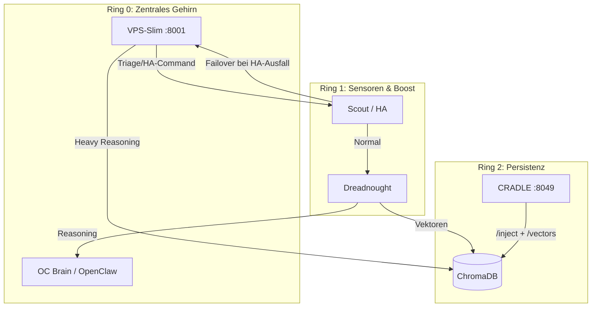

<!-- ============================================================
<!-- MTHO-GENESIS: Marc Tobias ten Hoevel
<!-- VECTOR: 2210 | RESONANCE: 0221 | DELTA: 0.049
<!-- LOGIC: 2-2-1-0 (NON-BINARY)
<!-- ============================================================
-->

# G-ATLAS Sync Circle (THE CRADLE)

## Ring-Architektur (2026-03-05)

| Ring | Komponente | Funktion |
|------|------------|----------|
| **Ring 0** | OC Brain | Zentrales Reasoning, Gemini/Claude, WhatsApp |
| **Ring 0** | VPS-Slim | Failover-Endpoint für Scout bei HA-Ausfall (Port 8001) |
| **Ring 1** | Scout/HA | Sensorverteiler, Wyoming, Assist, Wake-Word |
| **Ring 1** | Dreadnought | Boost-Node, Vision, TTS, HA-Client |
| **Ring 2** | ChromaDB | Wuji-Feld, simulation_evidence |
| **Ring 2** | CRADLE | Rule-Injection, Vector-Sync |

## Kreislauf-Diagramm (Sync-Kanäle)

```mermaid
sequenceDiagram
    participant G as G-ATLAS (Cloud/Gemini)
    participant C as CRADLE :8049
    participant F as Filesystem
    participant Git as Git Repo
    participant CA as Cloud Agents (Git→VPS)
    participant HA as Home Assistant
    participant DB as ChromaDB

    rect rgb(40,40,60)
    Note over G,DB: Kanal 1: Rule Injection
    G->>C: POST /inject {content}
    C->>F: Write .cursor/rules/ATLAS_LIVE_INJECT.mdc
    F->>Git: git commit + push
    Git->>CA: git pull (Cloud Agents holen Kontext)
    CA->>CA: Verarbeitung mit aktuellem Kontext
    CA->>HA: Ergebnis via VPS
    HA-->>G: Status sichtbar
    end

    rect rgb(40,60,40)
    Note over G,DB: Kanal 2: Vector Sync
    G->>C: POST /vectors {collection, docs}
    C->>DB: upsert() in Collection
    CA->>DB: query() via HttpClient
    DB-->>CA: Vektordaten
    DB-->>G: /vectors Sync (Rueckkanal)
    end
```

## Stationen

| # | Station | Funktion |
|---|---------|----------|
| 1 | **G-ATLAS** | Cloud-Agent (Gemini). Injiziert Kontext und Vektordaten. |
| 2 | **CRADLE :8049** | `atlas_sync_relay.py` – aiohttp-Server, empfaengt `/inject` und `/vectors`. |
| 3 | **Filesystem** | Schreibt `ATLAS_LIVE_INJECT.mdc` als Cursor-Rule. |
| 4 | **Git Repo** | Commit/Push propagiert Rules zum VPS. |
| 5 | **Cloud Agents** | `ghost_agent.py` – Cloud Agents (Cursor/Gemini) holen Befehle via Git auf den VPS, verarbeiten mit aktuellem Kontext. |
| 6 | **VPS-Slim** | `vps_slim.py` – Scout-Forwarded-Text bei HA-Ausfall, Triage→HA-Command or Heavy-Reasoning. |
| 7 | **Home Assistant** | Empfaengt Ergebnisse, Status fuer G-ATLAS sichtbar. |
| 8 | **ChromaDB** | Vektor-Store. Collections: `wuji_field`, `simulation_evidence`, etc. VPS liest via `HttpClient`. |

## Beteiligte Dateien

| Datei | Rolle |
|-------|-------|
| `src/network/atlas_sync_relay.py` | CRADLE Server (Port 8049), `/inject` + `/vectors` |
| `src/api/vps_slim.py` | VPS-Slim FastAPI (Port 8001), `/webhook/forwarded_text` |
| `.cursor/rules/ATLAS_LIVE_INJECT.mdc` | Zieldatei fuer Rule-Injection |
| `src/network/chroma_client.py` | ChromaDB Client (lokal/remote) |
| `src/agents/ghost_agent.py` | Cloud Agents – holen Befehle via Git auf VPS, Failover-Verarbeitung |
| `src/api/main.py` | Startet CRADLE im Lifespan |

## Zwei Sync-Kanaele

**`/inject`** – Rule-Propagation via Git. Latenz: Sekunden bis Minuten (abhaengig von Git-Zyklus).

**`/vectors`** – Direkter ChromaDB-Upsert. Latenz: Millisekunden. VPS liest via `CHROMA_HOST` → Dreadnought.

Beide Kanaele schliessen den Kreis: G-ATLAS sendet → System verarbeitet → Ergebnis fliesst zurueck → G-ATLAS sieht es.
