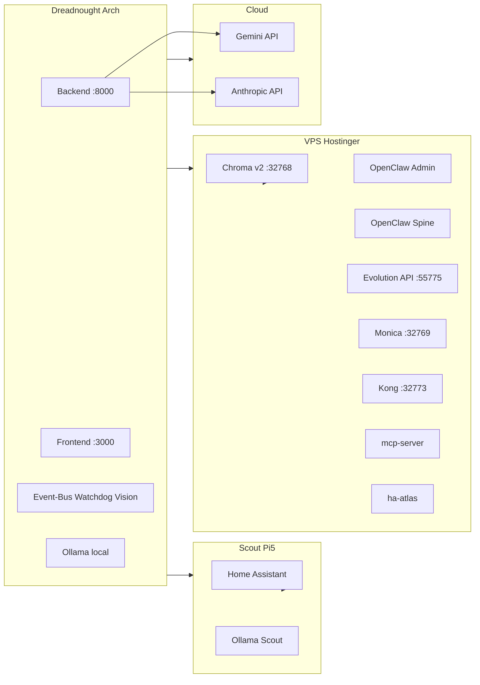

# OMEGA Linux Orchestrierung

**Vektor:** 2210 | 2201 | Delta 0.049
**Stand:** 2026-03-18
**Referenz:** `@docs/BIBLIOTHEK_KERN_DOKUMENTE.md` (immer einbinden).

---

## 1. Topologie unter Arch Linux

| Knoten | Rolle | Wichtige Dienste / Ports |
|--------|--------|---------------------------|
| **Dreadnought** | 4D_RESONATOR (lokal) | omega-backend (:8000), omega-frontend (:3000), omega-event-bus, omega-watchdog, omega-vision, ollama (:11434) |
| **Scout (Pi5)** | Edge, HA, Sensoren | Home Assistant (:8123), Ollama (:11434), Tapo/WhatsApp-Addon |
| **VPS** | OMEGA_ATTRACTOR, OC Brain, Chroma, WhatsApp, CRM, Gateway | chroma-uvmy (:32768), openclaw-admin (:18789), openclaw-spine (:18790), evolution-api (:55775), monica (:32769), kong (:32773), mcp-server (:8001), ha-atlas (:18123) |
| **Cloud** | Gemini, Anthropic | API-Key aus .env |

---

## 2. Modell-/Skill-Matrix

Siehe **`@docs/02_ARCHITECTURE/AI_MODEL_CAPABILITIES.md`** und Code `src/ai/model_registry.py`, `src/ai/api_inspector.py`.

Kurz: Triage → Ollama (Scout); Heavy → OpenClaw/Gemini bzw. Ollama-Fallback; Dictate/STT → Gemini 2.5 Flash; Vision-Daemon → Gemini 2.0 Flash; Embedding → Gemini oder nomic-embed-text.

---

## 3. Health- und Verifikations-Skripte

| Skript / Befehl | Zweck |
|-----------------|--------|
| `run_verification.sh` | Ring-0: PID/Cgroup Daemons, Ports 8000/3000, Ollama-Status |
| `curl -s http://localhost:8000/status` | Backend- und Event-Bus-Status |
| `src/scripts/verify_vps_stack.py` | VPS: SSH, docker ps, Chroma v2 heartbeat |
| `python -m src.scripts.run_whatsapp_e2e_ha` | WhatsApp E2E (HA → CORE → Antwort) |
| `chroma_audit.py` | Lokale ChromaDB (falls vorhanden); VPS: curl :32768/api/v2/heartbeat |

---

## 4. Testmatrix (E2E, messbar)

| Verbindung | Prüfung | Erwartung |
|------------|---------|-----------|
| Dreadnought → Backend | `curl -s http://localhost:8000/status` | JSON mit `event_bus.running` true |
| Dreadnought → Scout (HA) | `curl -sk -H "Authorization: Bearer $HASS_TOKEN" $HASS_URL/api/` | 200, body „API running“ o. ä. |
| Dreadnought → VPS (SSH) | `ssh -i $VPS_SSH_KEY root@$VPS_HOST "docker ps"` | Exit 0, Liste Container |
| Dreadnought → VPS Chroma | `curl http://$VPS_HOST:32768/api/v2/heartbeat` | 200, JSON heartbeat |
| Dreadnought → GitHub | `git push origin main` | Exit 0 |
| WhatsApp E2E | `python -m src.scripts.run_whatsapp_e2e_ha` | Exit 0, Antwort im Chat |
| MCP (Cursor) | MCP-Server „atlas-remote“ starten | Zugriff auf Workspace |

---

## 5. Push/Pull und Vollkreis

- **Was zieht / was drückt:** Vollständige Matrix und Einbindung Monica, Kong, Evolution, DBs: `@docs/03_INFRASTRUCTURE/VPS_KNOTEN_UND_FLUSSE.md`
- **Vollkreis-Plan (Team-Arbeitspakete, Linux-Auswirkungen):** `@docs/05_AUDIT_PLANNING/OMEGA_VOLLKREIS_PLAN.md`

## 6. Referenzen

- BIBLIOTHEK: `@docs/BIBLIOTHEK_KERN_DOKUMENTE.md`
- Schnittstellen: `@docs/02_ARCHITECTURE/CORE_SCHNITTSTELLEN_UND_KANAALE.md`
- VPS-Setup: `@docs/03_INFRASTRUCTURE/VPS_FULL_STACK_SETUP.md`
- VPS-Knoten & Flüsse: `@docs/03_INFRASTRUCTURE/VPS_KNOTEN_UND_FLUSSE.md`
- WhatsApp E2E: `@docs/03_INFRASTRUCTURE/WHATSAPP_E2E_HA_SETUP.md`

[LEGACY_UNAUDITED]
