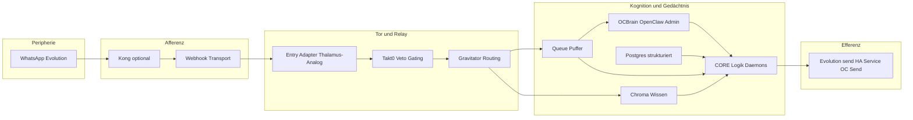

# MACRO-CHAIN — Entwurf 1 (VAR_1): Neurologisch-anatomische Makro-Kette

**Instanz:** Ring-1 System-Architekt  
**Vektor:** 2210 | **Delta:** 0.049  
**Datum:** 2026-04-01  
**Status:** Entwurf 1 — Abgleich mit `BIOLOGICAL_PRIMAT.md`, `MACRO_ARCHITECTURE_AUDIT.md`, `VPS_KNOTEN_UND_FLUSSE.md`, `CORE_SCHNITTSTELLEN_UND_KANAALE.md`

---

## 1. Biologisches Referenzmodell (strikt anatomisch)

### 1.1 Basissequenz (klassische Somatik)

| Phase | Neuroanatomischer Begriff | Funktion (kurz) |
|-------|---------------------------|-----------------|
| 1 | **Reiz / Transduktion** | Sinnesorgan wandelt physische Energie in Nervensignal um. |
| 2 | **Afferente Bahnen** | Erste bis dritte Neuron-Kette Richtung ZNS (Peripherie → Rückenmark/Hirnstamm → …). |
| 3 | **Thalamus (Relay-Kerngebiete)** | **Modalitäts- und zielspezifische Weiterleitung** nahezu aller Sinnesqualitäten zur Großhirnrinde (Ausnahme: Riechbahn). Kein „tiefer“ semantischer Abschluss, aber **topographische Sortierung**: *welcher Cortex bekommt welches Paket?* |
| 4 | **Kortex (assoziative Areale)** | Bindung, Vorhersage, Planung, Sprache, Werkzeugnutzung; **Arbeitsspeicher** und **Kontextintegration**. |
| 5 | **Efferente Bahnen** | Absteigende Kontrolle: von Kortex/Basalganglien/Hirnstamm zu motorischen Endbahnen. |
| 6 | **Endeffektor (Muskel, Drüse)** | Übersetzung in die Welt: Kontraktion, Sekretion, **sichtbare Handlung**. |

Ergänzend (nicht linear „vor“ dem Kortex, aber kausal entscheidend):

- **Rückenmark / Hirnstamm („unteres Tor“):** Reflexbögen, segmentale **Ja/Nein-Durchlässe**, autonome **sofortige** Reaktionen — **hohe Durchsetzungsmacht bei geringer kognitiver Tiefe**.
- **Thalamische retikuläre Formation / Hirnstamm-Arousal:** **Gating** — ob ein Pfad **jetzt** die Rinde erreicht oder gebremst wird (Aufmerksamkeit, Schmerz-Salienz, Start/Stopp).

### 1.2 Zuordnung der OMEGA-Begriffe Push / Pull / Pain / Knowledge / Command

| Begriff | Neuroanalogon | Kausalität |
|---------|---------------|------------|
| **Pull (afferent)** | Reiz + afferente Übertragung (+ teils thalamische Vorwegwahl) | Die **Welt** liefert Daten; das System **zieht** Eingang in die Zentralinstanz. |
| **Pain** | **Nozizeption + Salienznetzwerke** (nicht identisch mit „narrativem Schmerz“ im Kortex) | **Prediction Error** / Regelbruch **entsteht** als Alarm **unabhängig** davon, ob der Kortex bequem wäre (vgl. `BIOLOGICAL_PRIMAT.md`). |
| **Knowledge** | **Langzeit-Assoziation** (kortikal verteilt + **hippocampaler Konsolidierungsanteil** für neu declaratives Material) + **strukturierte Speicher** | Abruf und Aufprägung über **Gedächtnis-Substrate** (bei uns: Vektor- und relationale Stores). |
| **Command (efferent)** | Motorische Befehlskette bis Endeffektor | **Nach** interner Entscheidung: **Push** nach außen (Nachricht, Service, API). |
| **Push (efferent, umgangssprachlich)** | Ausgangskanal zur Peripherie | Synonym zur **Ausführungsphase** des Makro-Loops. |

---

## 2. Abstraktes Zielmodell (eine Zeile pro Schicht)

```
Reiz → Afferenz (Leitung + Vorfilter) → Thalamus-Analogon (Relay/Routing)
     → Kortex-Analogon (Kognition, Plan, Queue-Arbeit) → Efferenz → Muskel-Analogon (Kanal-Aktion)
```

Parallel (nicht ersetzend): **Nozizeptor / Homeostase** überwacht **Integrität der Kette** und kann **Unterbrechung** erzwingen (Ring-0-Thema: Pacemaker, Veto-Gates).

---

## 3. EXAKTE Komponenten-Map (OMEGA → Neuro-Analogon)

Die folgende Tabelle ist **normativ für VAR_1**: Sie beschreibt, **wo** im Nervensystem die jeweilige Rolle **am ehesten** sitzt — nicht Marketing-Metaphern.

| OMEGA-Komponente | Primäre neuroanatomische Rolle | Begründung (1 Satz) |
|------------------|-------------------------------|---------------------|
| **WhatsApp (Evolution API, ggf. HA-Addon)** | **Sinnesorgan + erste afferente Schnittstelle** (peripher) | Kapselt den **Rohevent** (Text/Medium), liefert **HTTP-Payload** — vergleichbar mit **Rezeptor + erstem Axon**, nicht mit Kognition. |
| **Transport (TLS, Webhook-HTTP)** | **Afferente Leitbahn** (peripheres „Kabel“) | Reiner **Übertragungskanal** ohne semantische Arbeit. |
| **Kong (optional, API-Gateway)** | **Prä-thalamisches / vasculäres Routing** (Einlass-Organisation) | **Einheitlicher Eintritt**, Rate-Limits, Auth — **sortiert den Strom**, bevor er die **interne Relay-Logik** trifft; **kein** Gedächtnis und **keine** Semantik. |
| **Entry Adapter (`NormalizedEntry`)** | **Thalamus (Relay-Kerne)** — erste zentrale **Normalisierung und Zieladressierung** | Wandelt heterogene Payloads in **einheitliche Repräsentation** und übergibt an Triage — entspricht **„welches Paket geht wohin?“** vor ausgiebiger Kognition (`CORE_SCHNITTSTELLEN_UND_KANAALE.md`). |
| **Takt 0 / Veto-Gate / Nociceptor-Pfade** | **Thalamische retikuläre Schale + Hirnstamm-Salienz** | **Hartes Gating**: Durchlass oder Abbruch **vor** oder **am Rand** der schweren Kognition — **Schmerz/Alarm** bleibt **nicht** Sache des „bequemen“ Planungsteils (`BIOLOGICAL_PRIMAT.md`). |
| **Gravitator (Embedding-Routing)** | **Thalamokortikale **Projektionswahl** (welcher kortikaler Subraum?)** | **Vektorische Zuordnung** zu Collections/Arbeitsbereichen = **topographisches Routing** analog „welcher Cortex-Bereich erhält den Input?“. |
| **ChromaDB (StateAnchor, RAG)** | **Langzeit-assoziatives Substrat** (kortiko-hippocampaler **Mischtyp**: Schnellabruf ähnlicher Muster) | **Distributed similarity memory** — nicht die Moment-Arbeit, sondern **Wissens-Feld** für Abruf und Anker. |
| **PostgreSQL / pgvector (Multi-View)** | **Strukturiert-deklaratives Gedächtnis** (parallel zu episodisch-semantischen Schemata) | **Relationale Fakten**, Metadaten, Jobs — **explizite** Struktur statt reiner Ähnlichkeit. |
| **Queue (persistente Job-Warteschlange, Soll: State-Hold)** | **Arbeitsgedächtnis-Puffer / prämotorische Haltestrecke** | Entkopplung **Eingang** von **Langläufer** = **PFC/Basalganglien-artige** „Aktion liegt an, aber Ausführung noch nicht blockierend gekoppelt“ (`SPEC_STATE_HOLD.md`, `MACRO_ARCHITECTURE_AUDIT.md`). |
| **OCBrain (langer Planungs- / LLM-Lauf, OpenClaw Admin als Gehirn-Hub)** | **Assoziativer Kortex + exekutive Steuerung** | Semantik, Agenten, Kanäle — **langsame** Integration; darf **nicht** den afferenten **Webhook-Thread** blockieren (Audit-Forderung). |
| **OpenClaw Spine** | **Satelliten-Schleife** (Analog: **zerebellär / sekundär-motorisch** — unterstützende Ausführung ohne volle „Großhirn“-Souveränität) | Nutzt Admin als Gateway; **abhängige** Instanz für spezialisierte Läufe. |
| **OMEGA_ATTRACTOR (Governance, O-Vektor, OC-seitig verortet)** | **Hirnstamm-/hypothalamische **Governance-Schicht**** (Homöostase-Vorgaben, nicht Alltagskognition) | **Schwellwerte und Veto-Physik** — in Doku als **attraktorischer Kern** gefasst, funktional **über** bloßer Chat-Logik. |
| **FastAPI-Orchestrierung (Gesamt-Backend auf Dreadnought)** | **Gesamt-Neuraxis-Koordination** (integratives **ZNS** — nicht ein einzelnes Organ) | **Führt** Relay, Gates, Clients und Ausgänge zusammen; **kein** einzelnes Organ, sondern **das operative Rückenmark+Kortex-System in Software**. |
| **Evolution `sendText` / HA `call_service` / OC-Kanal-Send** | **Efferenz bis Endeffektor (Muskel-Analogon)** | **Sichtbare Wirkung** nach außen — **Command** in der Makro-Kette. |
| **Monica (CRM)** | **Sozial-semantisches Kontextgedächtnis** (kortikal **spezialisiertes** Assoziationsfeld) | **Wer ist der Reizgeber?** — moduliert Antwort, **kein** primärer Nozizeptor. |
| **MCP (Cursor ↔ VPS)** | **Prothesen-Nerv** (Tool-Bahn **neben** der organismischen Geschäfts-Pipeline) | **Entwickler-Zugriff**, **kein** Ersatz für Webhook→Queue→Worker (`MACRO_ARCHITECTURE_AUDIT.md`). |

---

## 4. Wo das Wording / die Architektur „hinkt“ (Drift-Diagnose VAR_1)

### 4.1 Ist Spline das Rückenmark — oder eher der Thalamus?

**Kanontext (`BIOLOGICAL_PRIMAT.md`):** „Rückenmark / Stamm (Tor, ‚Spline‘)“ = **dumm, mächtig**, **Ja/Nein** nach harten Regeln.

**Strikte Neuroanatomie:**

- Der **Thalamus** ist primär ein **Relay mit topographischer Sortierung** zum Kortex — **nicht** „dumm“ im gleichen Sinn wie ein **monosynaptischer Reflex**.
- Das **Rückenmark** führt **segmentale Reflexe** und **schnelle** Durchlässe aus; absteigende **Befehle** enden hier an der **Endbahn** — **Hoheit bei geringer kognitiver Tiefe**.

**Betrieblich (OCSpline = FastAPI-Webhook-Pfad, schnelles ACK):**

- Die Kombination aus **sofortiger HTTP-Quittung** + **hartem Tor** ist **am nächsten** am **Hirnstamm / autonomen Antwortsegment** und am **Gating vor Langläufern** — nicht am klassischen **VP-Thalamus-Relay**.
- Die **echte thalamusnahe Funktion** (Normalisierung, „wohin mit dem Input?“) liegt im **Entry Adapter + Gravitator** — **nicht** im bloßen „Spline“-Namen allein.

**VAR_1-Urteil:**

| Metapher | Bewertung |
|----------|-----------|
| **Spline = Rückenmark** | **Teilweise korrekt** für **Veto-Durchsetzung** und **Nicht-Verhandeln** mit der Kognition — **falsch**, wenn man darunter **semantisches Routing** versteht. |
| **Spline = Thalamus** | **Größtenteils falsch** — der Thalamus ist **Relay/Sortierung**, nicht der **Reflex-ACK-Thread**. |
| **Präziseres Etikett für OCSpline** | **„Subkortikales Tor / Hirnstamm-Gate“** (ACK + Regeln) **plus** Schnittstelle zum **Queue-Puffer**; **Thalamus** bleibt **Entry Adapter + Gravitator**. |

**Konsequenz:** Das Team sollte **Spline** nicht mit **Thalamus** gleichsetzen und **Rückenmark** nur dort verwenden, wo **Ausführungsmacht ohne Diskussion** gemeint ist — nicht für **Embedding-Routing**.

### 4.2 Weitere häufige Verschiebungen

| Risiko | Befund |
|--------|--------|
| **OpenClaw Admin = „ganzes Gehirn“** | Admin ist **Hub** für externe KI und Kanäle; **gesamte Kognition** des OMEGA-Loops liegt **auch** in **CORE** (Gravitator, Triage, Daemons). **Drift:** OC **ersetzt** nicht das Dreadnought-Gehirn. |
| **Chroma = Kognition** | Chroma ist **Gedächtnis-Substrat**, nicht **Denken**. Kognition = **Prozess** auf Backend + OC + Modellen. |
| **Kong = Thalamus** | Kong ist **Vorhof/Routing-Infrastruktur**, **kein** sensorischer Relay zum Kortex — eher **„prä-zentraler Einlass“**. |
| **Queue fehlt im Live-System** | Architektonisch **prämotorischer Puffer**; ohne sie kollabiert die Kette bei Langläufern in **I/O-Tod** (Audit) — **organismisch** wie **fehlende Trennung** von Reflexantwort und Kortex-Laufzeit. |
| **WhatsApp als „Kortex“** | Falsch: WhatsApp ist **Peripherie/Rezeptorfläche** für Text-Medien. |

---

## 5. Makro-Kette in einem Diagramm (VAR_1)



**Hinweis:** **OCSpline** im Audit-Sinne ist die **kombinierte Schicht** aus **schnellem Webhook-Eingang + Tor + ACK** — im Diagramm als **Kante HTTP → EA → T0** und **sofortige Rückgabe an Evolution** (nicht eingezeichnet: parallele **200 OK**-Antwort).

---

## 6. Kurzfazit (Ring-1)

Die **streng neurologische** Makro-Kette von OMEGA ist: **peripherer Reiz (WhatsApp) → Leitung (HTTP/Kong) → thalamusartiger Relay (Entry Adapter, Gravitator) → kortikale Arbeit (CORE + Queue + OCBrain) mit parallelem **Langzeitgedächtnis** (Chroma/Postgres) → efferenter Befehl (Send/Service). **Spline** bleibt im Kanon ein **subkortikales Tor**; **Thalamus** sollte **Wording-seitig** Entry Adapter + Routing abdecken, nicht den schnellen Webhook-ACK. **Pain** sitzt bei **Veto/Nozizeption/Homeostase**, **Knowledge** bei **Chroma/Postgres**, **Command** bei **Ausgangskanälen**.

---

*Entwurf 1 — Turn abgeschlossen.*


[LEGACY_UNAUDITED]
