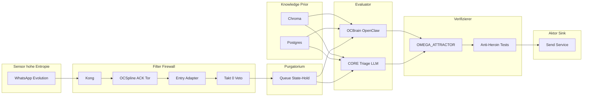

# MACRO-CHAIN — Entwurf 2 (VAR_2): Informationstheorie & Zero-Trust (Pain / Trust / Knowledge)

**Instanz:** Ring-1 System-Architekt  
**Vektor:** 2210 | **Delta:** 0.049  
**Datum:** 2026-04-01  
**Status:** Entwurf 2 — Ergänzt `MACRO_CHAIN_VAR_1.md` (neurologisch); gleiche Komponentenbasis, andere **Erklärungsebene**: Shannon/Kanalcodierung + Zero-Trust.

---

## 1. Prinzip (abstrakt, vor der Komponenten-Map)

### 1.1 Informationstheoretische Lesart

Jede Stufe der Makro-Kette ist ein **Kanal** mit **Rauschen** und **Latenz**. Ziel ist nicht „maximale Datenmenge“, sondern **minimale Fehl-Handlungswahrscheinlichkeit** bei gegebener Bandbreite: der Operator soll **nur** Aktionen sehen, die aus **verifizierbaren** Zuständen folgen — nicht aus **plausibel klingenden** LLM-Füllungen.

| Begriff | Rolle in der Kette |
|---------|-------------------|
| **Entropie (Eingang)** | Rohevents (WhatsApp, Webhooks) tragen **hohe** Unsicherheit: Absender, Intent, Payload-Integrität sind **nicht** selbst-evident. |
| **Redundanz / Prüfsumme** | Auth (Kong, HMAC), Takt-0, Schema-Normalisierung = **Kanalcodierung** und **Fehlererkennung** vor teurer Verarbeitung. |
| **Verzögerung als Ressource** | Purgatorium/Queue erhöht **zeitliche Entkopplung** = verhindert, dass ein **kurzer** HTTP-Kanal gezwungen wird, **lange** Transformationen zu „simulieren“ (Timeout = informeller Informationsverlust). |
| **Transformation (LLM)** | **Hohentropische** Abbildung: Ausgabe ist **nicht** beweisbar wahr, nur **konsistent** mit Prompt + Modell. Daher **Pflicht** auf nachgelagerte Verifikation. |
| **Sink (Aktion)** | Ausgang reduziert Welt-Zustand (Nachricht gesendet, Service aufgerufen) — **irreversibel** im sozialen/operativen Sinn; Fehler hier sind **teuer**. |

### 1.2 Zero-Trust und die drei OMEGA-Größen

| Größe | Zero-Trust-Bedeutung |
|-------|----------------------|
| **Pain** | **Nociception / Alarm:** Regelbruch, Integritätsfehler, Timeout, Veto — **hartes Signal**, das **nicht** mit „bequemer“ Narration im LLM verhandelt werden darf (vgl. `BIOLOGICAL_PRIMAT.md`, Axiom A7). Pain **senkt** fälschlich zugewiesenes Vertrauen. |
| **Trust** | **Kein Default-Trust** pro Hop: jede Schicht darf nur annehmen, was die **vorige** durch Signatur, Persistenz oder wiederholbare Messung **beglaubigt** hat. **LTP** (langsamer Aufbau) vs. **Boolean Collapse** (ein Fehler → Minimum). |
| **Knowledge** | **Prior / Speicher:** Chroma, Postgres, Monica — **reduzieren** Entropie bei Abruf, **ersetzen** aber **keine** Verifikation der **aktuellen** Handlung (Stale Knowledge = stealth noise). |

---

## 2. Abstrakte Makro-Kette (normativ für VAR_2)

```
Sensor → Filter/Firewall → Purgatorium/Queue → Evaluator (LLM) → Verifizierer → Aktor
```

| Phase | Funktion | Info-Fluss | Zero-Trust-Kernfrage |
|-------|----------|------------|----------------------|
| **1. Sensor** | Erfasst **Rohevent** aus der Welt (Nachricht, HTTP POST, Stream-Chunk). | Hohe Entropie **einspeisen**, nicht interpretieren. | *Ist die Quelle identisch mit dem, wer sie vorgibt?* |
| **2. Filter / Firewall** | Transport-Sicherheit, Rate-Limits, Allowlists, Takt-0, Schema-Trennung. | **Rauschen und Angriffe** vor der teuren Stufe dämpfen; **Reject** ohne LLM. | *Darf dieser Frame die nächste Stufe überhaupt erreichen?* |
| **3. Purgatorium / Queue** | Persistenter Puffer; **Ack** an Sensor-Kanal **ohne** Abschluss der Kognition. | **Zeitliche** und **prozessuale** Entkopplung (Kapazität des schnellen Kanals schonen). | *Ist der Job **recorded** und **replaybar**, nicht nur „im Kopf“ des Workers?* |
| **4. Evaluator (LLM)** | Semantik, Planung, Zusammenführung mit Tools — **generative** Stufe. | **Maximale** semantische Entropie in der Kette. | *Wird das als **Hypothese** behandelt, nicht als Fakt?* |
| **5. Verifizierer** | Tests, Anti-Heroin-Checks, Veto-Gates, Abgleich mit Policy/Attractor, ggf. zweiter Modell-Pass, **Messung** gegen DB. | **Entscheidungsreduktion** vor irreversibler Ausgabe. | *Gibt es einen **unabhängigen** Beweis für „darf raus“?* |
| **6. Aktor** | SendText, HA `call_service`, API-Write — **Wirkung** nach außen. | Niedrige Entropie am Kanal **wenn** Verifizierer grün. | *Stimmt die ausgehende Aktion mit dem **persistierten** Intent überein?* |

**Parallele Schicht (nicht linear „danach“):** **Knowledge-Stores** (Chroma, Postgres) speisen **Evaluator** und **Verifizierer** mit **Prior** — sie sind **kein** Ersatz für Phase 5.

---

## 3. Komponenten-Map (OMEGA → abstraktes Modell)

| Komponente | Primäre Phase(n) | Kurzbegründung |
|------------|------------------|----------------|
| **WhatsApp (Evolution API, ggf. HA)** | **Sensor** | Liefert **Rohevent**; Identität des Nutzers ist **Behauptung** bis CRM/Session sie stützt. |
| **TLS / Webhook-Transport** | **Filter** (schwach), Kanal | Integrität auf **Transportebene**; **keine** semantische Wahrheit. |
| **Kong (API-Gateway)** | **Filter / Firewall** | Auth, Routing, Limits — **Perimeter** vor Applikationslogik; **kein** Gedächtnis. |
| **OCSpline** (schneller FastAPI-Webhook-Pfad: Empfang + Tor + **sofortiges** ACK) | **Filter** + **Schnittstelle zu Purgatorium** | Trennt **Lebensdauer des HTTP-Requests** von **Lebensdauer der Arbeit**; **irreführend**, wenn „Spline“ mit **Denken** oder **Routing** gleichgesetzt wird (siehe §4). |
| **Entry Adapter (`NormalizedEntry`)** | **Filter** (semantische Vorform) | Reduziert **Format-Entropie** — einheitliches Schema; **kein** LLM-Urteil. |
| **Takt 0 / Veto-Gate** | **Filter** (hart) | Boolean **Durchlass** — klassischer **Firewall**-Moment im CORE-Sinn. |
| **Queue / State-Hold (Soll)** | **Purgatorium** | Persistenz + Entkopplung; ohne sie: **Kanalüberlastung** und **informationsäquivalente** Timeouts (= Datenverlust). |
| **Gravitator** | **Vor-Evaluator-Routing** | **Weichenstellung** (welche Collection / welcher Pfad) — näher an **adaptivem Multiplex** als an „Gehirn“. |
| **ChromaDB** | **Knowledge** (Prior für Evaluator & Verifizierer) | Ähnlichkeitsabruf; **Risiko:** „klingt passend“ ≠ **wahr** für die aktuelle Aktion. |
| **PostgreSQL / pgvector** | **Knowledge** + **Purgatorium-Backing** (wenn Jobs dort) | Strukturierte Wahrheit + **Audit-Spur** möglich. |
| **OCBrain / OpenClaw Admin** | **Evaluator** (+ teils Tool-Zugriff) | **Höchste** epistemische Risikostufe; darf **nicht** allein **Verifizierer** und **Aktor** sein. |
| **OpenClaw Spine / Satelliten** | **Evaluator-Hilfskanal** | Abhängig vom Admin-Hub — **Trust** kaskadiert; kein eigener Zero-Trust-Root. |
| **OMEGA_ATTRACTOR (VPS)** | **Verifizierer** (Governance-Schicht) | Schwellen, Veto-Physik — **normativ** über Chat-Plausibilität. |
| **Anti-Heroin-Validator, Tests, Pacemaker-Metriken** | **Verifizierer** (verschiedene Domänen) | Automatisierte **Pain**- oder **Beweis**-Signale vor Commit/Ausgabe. |
| **Evolution `sendText` / HA `call_service` / OC-Send** | **Aktor** | **Irreversible** oder kostenintensive **Sink** — hier zählt jeder Trust-Fehler doppelt. |
| **Monica (CRM)** | **Knowledge** (sozialer Prior) | Reduziert **Wer-ist-was**-Entropie; **kein** Ersatz für technische Verifikation. |

---

## 4. Wo die Namensgebung in die Irre führt

| Name | Suggestive Metapher | Tatsächliche Rolle (VAR_2) | Risiko |
|------|---------------------|----------------------------|--------|
| **Spline** | „Rückgrat“, glatte Verbindung, manchmal **Thalamus** | **Schnittstelle + Tor** zwischen **hochfrequentem** Eingang und **langsamer** Verarbeitung; stark **Filter/Purgatorium-Grenze** | Team denkt **Routing = Spline** und verschiebt **semantische** Verantwortung falsch (Gravitator/Entry Adapter). |
| **Brain (OCBrain)** | **Ganzes Denken**, Autorität | **Evaluator-Subsystem** auf VPS; **CORE** (Dreadnought) bleibt **gleichzeitig** Denk- und Verifikationsort | **Single-Point-of-Illusion:** „Das Brain hat entschieden“ — Zero-Trust verlangt **nachgelagerten** Beweis, nicht Metapher. |
| **Chroma / „Wissensbasis“** | **Fakten** | **Prior / Embedding-Feld** | **Confabulation:** RAG liefert **kohärente** Snippets — **Verifizierer** muss trotzdem fragen: *passt das zur **Policy** und zum **Job-Record**?* |
| **Kong** | „Intelligentes Tor“ | **Perimeter-Filter** | **Überschätzung:** Kong **validiert** keine LLM-Ausgaben. |
| **Queue** (wenn nur konzeptionell) | „Alles gut, wir haben eine Queue“ | Ohne Implementierung: **fiktives** Purgatorium | **Heroin-Traum:** Architekturdiagramm suggeriert Entkopplung, **Ist** bleibt synchron blockiert (`MACRO_ARCHITECTURE_AUDIT.md`). |

---

## 5. Trust-Lücken („Heroin-Träume“) in der aktuellen Kette

**Definition (operativ):** Eine Lücke liegt vor, wenn **plausible** Ausgabe oder **grüner** HTTP-Status **Trust substituiert**, ohne dass Phase **5** (Verifizierer) mit **unabhängigem** Kriterium eingreift.

| Lücke | Mechanismus | Pain-Signal (sollte feuern) |
|-------|-------------|----------------------------|
| **Synchrone Kette bis OCBrain** | Evolution/Kong erwarten Antwort in **Sekunden**, LLM **Minuten** | Timeouts, stille Drops, halbe Antworten — **User glaubt**, System „hat verarbeitet“ |
| **Fehlende oder unvollständige Queue** | Worker und Persistenz nicht kanonisch am Webhook | Kein **replaybarer** Job — bei Crash **kein** Beweis, was hätte passieren sollen |
| **LLM-Ausgang ohne messbaren Verifizierer** | Text geht direkt zu **Aktor** | **Halluzination** wirkt wie **Command** — kein `anti_heroin` / kein zweiter Gate vor Send |
| **Chroma-Treffer = Wahrheit** | Gravitator/RAG liefert „best match“ | **Stale** oder **falsche** Collection — Evaluator **überzeichnet** Confidence |
| **Zwei Gehirne ohne einheitliche Verifikation** | CORE und OCBrain parallel | **Widersprüchliche** Handlungen oder **doppelte** Sends — fehlende **Single-Writer**- oder **Veto**-Instanz für **Aktor** |
| **MCP / Cursor als „Nebenbahn“** | Ad-hoc SQL/Vektor | **Nicht** die gleiche Audit-Kette wie Webhook→Queue — **Trust** für Operator-Aktionen darf nicht von **IDE-Session** abhängen |
| **Fehlende Bindung Pacemaker ↔ Message-Pipeline** | Zwei starke Narrative ohne gemeinsames Sequenzmodell | Homeostase **grün**, Nachrichtenpfad **rot** — **scheinbare** Systemgesundheit |

---

## 6. Diagramm (informationeller Fluss)



**Lesart:** **Knowledge** speist **Evaluator** (und indirekt **Verifizierer** über Policies/DB); **Verifizierer** blockiert den Weg zum **Aktor**, nicht umgekehrt.

---

## 7. Kurzfazit (Ring-1)

VAR_2 beschreibt dieselbe OMEGA-Makro-Kette wie VAR_1, aber in der Sprache von **Kanälen, Entropie und Zero-Trust**: **WhatsApp/Kong/Spline** gehören zu **Sensor** und **Filter** (plus **Brücke** zum **Purgatorium**), **Queue** ist die **informationstheoretisch notwendige** Entkopplung, **Chroma/Postgres/Monica** sind **Knowledge-Priors**, **OCBrain** ist **Evaluator** — **nicht** Verifikation. **Trust-Lücken** entstehen dort, wo **Plausibilität** oder **schnelle** HTTP-Semantik **Pain** und **unabhängige** Prüfung ersetzen. **Namen** wie **Spline** und **Brain** sind **operativ** nur dann harmlos, wenn jedes Teammitglied sie als **Rollen in Phase 2–4** liest, **nicht** als Ersatz für **Phase 5**.

---

*Entwurf 2 — Turn abgeschlossen.*


[LEGACY_UNAUDITED]
