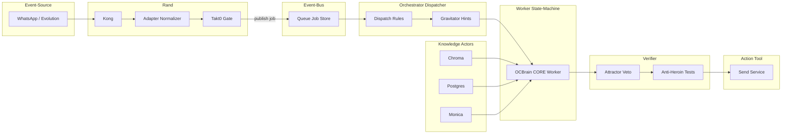

# MACRO-CHAIN — Entwurf 3 (VAR_3): Agentic Actor Model (Ereignis, Bus, Orchestrierung)

**Instanz:** Ring-1 System-Architekt  
**Vektor:** 2210 | **Delta:** 0.049  
**Datum:** 2026-04-01  
**Status:** Entwurf 3 — Ergänzt `MACRO_CHAIN_VAR_1.md` (neurologisch) und `MACRO_CHAIN_VAR_2.md` (Informationstheorie / Zero-Trust) um eine **implementierungsnahe** Lesart: **asynchrone Aktoren**, **Nachrichten-Bus**, explizite **Zustandsmaschinen** und **Werkzeug-Ausführung**.

---

## 1. Abstraktes Prinzip (normativ für VAR_3)

### 1.1 Die fünf Hop-Typen (Message-Passing)

Die Makro-Kette wird **nicht** als „ein durchlaufender HTTP-Request“ modelliert, sondern als **Kette von Ereignissen und Nachrichten**, die **Aktoren** (Adressen mit Verhalten) austauschen. Jeder Hop hat **eine** klar definierte Verantwortung.

```
Event-Source  →  Event-Bus  →  Orchestrator / Dispatcher  →  State-Machine / Worker  →  Action / Tool
```

| Hop | Aufgabe | Typische Garantien (Soll) |
|-----|---------|---------------------------|
| **1. Event-Source** | Erzeugt **Domänenereignisse** (Nachricht eingegangen, Webhook, Timer, interner Trigger). Kennt **keine** Ziel-Implementierung — nur Fakten + Metadaten. | Authentizität der Quelle **so weit wie möglich** am Rand (Signatur, Session, Allowlist). |
| **2. Event-Bus** | **Transport + Persistenz der Nachricht** zwischen Produzenten und Konsumenten; entkoppelt Zeitskalen (schneller Eingang ≠ langsamer Worker). | At-least-once oder explizit dokumentiert; **sichtbare** Fehler statt stiller Drops. |
| **3. Orchestrator / Dispatcher** | **Routing**: welcher **Job-Typ**, welcher **Worker-Pool**, welche **Priorität**; **kein** semantisches „Denken“ über Inhalt, höchstens **Policy-Weichen** (Schema, Tenant, Kanal). | Deterministisch aus `(event_type, headers, minimaler Kontext)`; idempotente **Dispatch-Entscheidung** wo möglich. |
| **4. State-Machine / Worker** | **Langläufer**: lädt Kontext (Knowledge), führt **hypothetische** Schritte aus (LLM, Plan), hält **expliziten Zustand** (received → triaged → planned → verified → …). | Zustand **persistiert**; Crash = **Fortsetzung** oder **sichtbarer** Dead-Letter, nicht „vergessen“. |
| **5. Action / Tool** | **Seiteneffekt** nach außen oder in autoritative Systeme: Send, `call_service`, API-Write, Commit. | Nur nach **Verifikations-Gate** (siehe VAR_2: Phase „Verifizierer“); **kein** direkter Draht von Roh-LLM-Text zum Aktor ohne Beweis. |

**Querschnitt (nicht ein sechster linearer Hop):** **Knowledge-Actors** (Lesen/Schreiben in Chroma, Postgres, CRM) antworten auf **Anfragen** der Worker — sie sind **kein** Ersatz für Hop 5 und ersetzen **nicht** die Verifikation.

### 1.2 Minimal-Vokabular (Implementierung)

- **Nachricht:** serialisierbares Record mit `event_id`, `correlation_id`, `occurred_at`, `payload`, `routing_hints`.
- **Aktor:** Prozess/Dienst mit **Mailbox** (Queue-Topic, Consumer-Gruppe, Inbox-Tabelle).
- **Orchestrator:** oft **derselbe** Binary wie „API“, aber **logisch getrennt** vom synchronen HTTP-Handler (Handler **published** nur).
- **Worker:** führt **State-Machine** für **einen** Job aus; darf **Sub-Nachrichten** publishen (z. B. „need_embedding“, „await_human“).

---

## 2. Komponenten-Map (OMEGA → Actor-Modell)

Die Zuordnung ist **funktional**; Produktnamen bleiben in Klammern als **Deployments**, nicht als Rollendefinition.

| Komponente | Primäre Actor-Rolle(n) | Kurzbegründung |
|------------|-------------------------|----------------|
| **WhatsApp (Evolution API, ggf. HA)** | **Event-Source** | Erzeugt **InboundMessageReceived** (o. ä.); Inhalt ist **Behauptung** bis angebunden an CRM/Session. |
| **TLS / Webhook-Transport** | Kanal zum Bus (kein Aktor mit Geschäftslogik) | Liefert Bytes; **kein** eigenes Zustandsmodell für die Makro-Kette. |
| **Kong** | **Rand-Aktor** / **Policy-Gate** vor dem Kern | Auth, Rate-Limits, Routing — **Filter** auf dem Weg zur ersten **Bus-Publication**; kein Gedächtnis der Job-Lebenszyklus. |
| **OCSpline (schneller Webhook-Pfad)** | **Adapter + Gate** zwischen HTTP und Bus | Typisch: **validieren/normalisieren → ACK → publish**; **nicht** der Ort, an dem die **State-Machine** blockierend lebt. |
| **Entry Adapter (`NormalizedEntry`)** | **Serializer / Normalizer** (Teil des Adapters oder des Dispatchers) | Reduziert Schema-Varianz **vor** Dispatch; **deterministisch**. |
| **Takt 0 / Veto-Gate** | **Hard-Guard** (sync oder vor Publish) | Kann **Nachricht verwerfen** oder **Pain-Event** erzeugen — boolean, **kein** LLM. |
| **Queue / State-Hold / Job-Store** | **Event-Bus + Persistenz** (logisch; Implementierung: Broker, DB, Daemon) | Macht aus „Request“ ein **überlebensfähiges** `JobRecord`; ermöglicht Worker ohne Blockade des Sensors. |
| **core_event_bus / omega-\* Daemons** | **Bus-Infrastruktur** oder **Bridge-Aktoren** | Tragen Events zwischen HA, Vision, Backend — je nach Topic **Source**, **Relay** oder **Worker-Nebenkanal**. |
| **Gravitator** | **Dispatcher-Hilfe** (Routing nach Embedding/Collection) | **Weiche** für Knowledge-Pfade; **kein** alleiniger „Entscheider“ über irreversible Aktionen. |
| **ChromaDB** | **Knowledge-Actor** (read-heavy, ggf. write durch Ingest) | Ähnlichkeitsabruf = **Anfrage/Antwort** an den Worker; Treffer ≠ Wahrheit (VAR_2). |
| **PostgreSQL / pgvector** | **Knowledge-Actor** + **System of Record** für Jobs/Audit | Strukturierte Wahrheit, **Zustand** der State-Machine wenn dort modelliert. |
| **OCBrain / OpenClaw Admin** | **Worker** (planend, tool-aufrufend) **innerhalb** einer größeren State-Machine | LLM-lastiger **Hypothesen-Generator**; **muss** an **Verifier** und **Action-Gate** gekoppelt sein. |
| **OpenClaw Spine / Satelliten** | **Sub-Worker** oder **Tool-Provider** | Führt Spezialaufträge aus; **Trust** folgt dem Hub + Policies. |
| **OMEGA_ATTRACTOR / Veto-Physik** | **Verifier-Actor** (Governance) | **Normative** Prüfung vor **Action**; kann **Veto**-Events zurück auf den Bus legen. |
| **Anti-Heroin-Validator, Tests, Pacemaker** | **Verifier** (automatisiert) / **Observability-Actor** | Erzeugt **Pain** oder **PASS** als **Fakten** für die Pipeline oder CI — nicht „Meinung“. |
| **Evolution sendText / HA call_service / OC-Send** | **Action / Tool** | **Sink** — hier endet die Kette operativ; Fehler sind **sozial oder operativ** teuer. |
| **Monica (CRM)** | **Knowledge-Actor** (sozialer Kontext) | Liefert **Prior** für Identität/Beziehung; ersetzt **keine** technische Signaturprüfung. |

---

## 3. Biologische Namen vs. Actor-Rollen (Klärung)

### 3.1 Wozu „Spline“ und „Brain“ überhaupt taugen

| Metapher | Kommunikativer Nutzen | Epistemisches Risiko |
|----------|----------------------|----------------------|
| **Spline** | Prägt die **Idee der tragenden Verbindung** zwischen schnellem Eingang und langsamer Verarbeitung. | Weckt **falsche** Erwartungen: „Spline denkt mit“, „Spline routet semantisch“, „Spline ist das Rückgrat der Kognition“. In VAR_1/VAR_2 sitzt die Rolle **je nach Implementierung** näher an **Relay/Tor** als an **Kortex**. |
| **Brain (OCBrain)** | Macht **sichtbar**, dass hier **hochvarianz** (LLM, Agenten) gebündelt ist. | Weckt **Autoritäts-Illusion**: „Das Brain hat entschieden“ — in einem Actor-Modell ist das nur **ein Worker-Zustand**, bis **Verifier + erlaubte Transition** nachweisbar sind. |

**Fazit:** Biologische Namen sind **narrative Anker** für Menschen und Doku. Sie sind **keine** Substitute für **typisierte Actor-Rollen**. Wer intern nur „Spline“ sagt, ohne zu sagen **Adapter**, **Gate**, **Publisher**, riskiert **Architektur-Drift** (synchrone Kette, fehlende Queue, LLM vor Bus).

### 3.2 Kanonische interne Rollen (empfohlen)

Für Spezifikation, Tickets und Code-Reviews sollte jedes Modul **mindestens eine** dieser Rollen tragen (mehrfach nötig = mehrere explizit benennen):

| Interne Rolle | Was sie tut | Typische OMEGA-Zuordnung |
|-----------------|------------|---------------------------|
| **Source** | Erzeugt Ereignisse | WhatsApp, HA-Events, Timer |
| **Adapter** | Normalisiert Außenformat → interne Nachricht | Entry Adapter, Webhook-Handler |
| **Gate** | Boolean / Policy ohne Semantik | Kong (teilweise), Takt 0, Nociceptor |
| **Bus / Store** | Hält und liefert Nachrichten/Jobs | Queue, State-Hold, Broker |
| **Dispatcher** | Wählt Worker/Typ aus Regeln | Routing in FastAPI/Daemon-Schicht, Gravitator-Anteile |
| **Worker** | State-Machine + ggf. LLM | OCBrain-Lauf, CORE-Chat-Pipeline (je nach Schnitt) |
| **Knowledge** | Liest/schreibt Speicher ohne finale Welt-Wirkung | Chroma, Postgres, Monica |
| **Verifier** | Prüft Transition zu **Action** | Attractor, Anti-Heroin, Tests, Policy |
| **Action** | Irreversible oder autoritative Writes | sendText, `call_service`, kritische API-Posts |

**Spline** lässt sich dann sauber beschreiben als: **Adapter + Gate (+ optional Publisher)** am **Rand** — **nicht** als Oberbegriff für „alles zwischen WhatsApp und Antwort“.

**Brain** lässt sich sauber beschreiben als: **Worker (Plan/Tool)** mit **explizitem** Zustand im Job — **nicht** als alleinige Instanz von „OMEGA denkt“.

---

## 4. Zusammenspiel mit VAR_1 und VAR_2

| Entwurf | Primäre Sprache | Nutzen |
|---------|-----------------|--------|
| **VAR_1** | Neuro-Anatomie | Intuition für **Gating**, **Thalamus vs. Kortex**, **Nozizeption**. |
| **VAR_2** | Kanal, Entropie, Zero-Trust | Wo **Trust** und **Pain** sitzen; Warum **Verifier** vor **Sink** Pflicht ist. |
| **VAR_3** | Aktoren, Bus, Zustand | Wie man **deployt**, **skaliert** und **debuggt** — ohne einen Thread zu **Halluzination + Send** zusammenzuziehen. |

**Konsistenz:** Der **Verifier** aus VAR_2 ist in VAR_3 ein **eigener Aktor** (oder **Zustandsübergang** mit eingebauter Prüfung), der **zwischen** Worker und Action sitzt. **Knowledge** aus VAR_2 entspricht **Knowledge-Actor**-Aufrufen **innerhalb** des Workers, nicht einem Shortcut zum **Action**-Hop.

---

## 5. Diagramm (Actor + Bus)



**Lesart:** **Knowledge** speist den **Worker**; nur **Verifier** (und ggf. weitere Gates) erlaubt den Übergang zu **Action**. Der **Bus** ist die Stelle, an der **Asynchronität** **institutionalisiert** wird — nicht nur „wir hoffen, der Request reicht lange“.

---

## 6. Kurzfazit (Ring-1)

VAR_3 formuliert die OMEGA-Makro-Kette als **Agentic Actor Model**: **Quellen** publizieren **Ereignisse**, der **Bus** überlebt **Zeitskalen**, **Dispatcher** wählen **Worker**, **Worker** führen **Zustandsmaschinen** mit **Knowledge**-Aufrufen aus, **Verifier** blockieren **Actions** bis zum Nachweis. **WhatsApp, Kong, Spline, Queue, Chroma, OCBrain** sind **konkrete Instanzen** dieser Rollen — nicht umgekehrt.

**Biologische Namen** bleiben **legitim für Narration**, aber **intern** sollten **Spline** und **Brain** als **Router/Adapter/Gate** bzw. **Worker (Evaluator-Anteil)** gelesen werden, damit keine **falschen** Annahmen über **Autorität**, **Synchronität** oder **Gedächtnisort** entstehen.

---

*Entwurf 3 — Turn abgeschlossen.*


[LEGACY_UNAUDITED]
