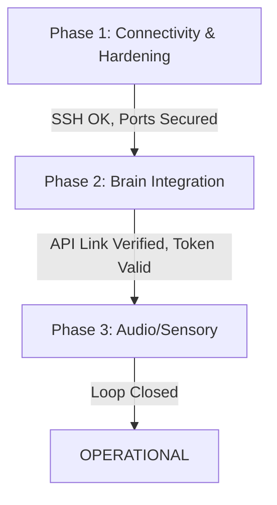

# OPERATION CORTEX EXECUTION PLAN

**Status:** DRAFT
**Author:** Lead Planner (Strand 1)
**Date:** 2026-03-02

## 1. Übersicht & Zielsetzung

Dieser Plan definiert die **exakte Ausführungsreihenfolge** zur Inbetriebnahme von ATLAS CORTEX. Er dient als strikte Anweisung für die operativen Worker-Agenten.

**Ziel:** Vollständige operative Bereitschaft von Connectivity, Brain-Integration und Audio-Sensorik.

---

## 2. Phasen & Abhängigkeiten (Critical Path)

Die Phasen bauen logisch aufeinander auf. Ein Starten der nachfolgenden Phase ist erst zulässig, wenn die **Definition of Done (DoD)** der vorherigen Phase erfüllt ist.

---

## 3. Rollen & Stellenbeschreibungen (Job Descriptions)

Jeder Worker übernimmt exakt eine Rolle.

### ROLLE 1: Senior VPS Admin
**Zuständigkeit:** Phase 1 (Connectivity & Hardening)

*   **Profil:**
    *   **Skills:** Linux System Administration, SSH Key Management, UFW/Firewalls, Docker Container Management, Netzwerk-Routing.
    *   **Mindset:** "Paranoid Security" – Default Deny.

*   **Kontext & Dateien:**
    *   **Config:** `.env` (Prüfung von `VPS_HOST`, `SSH_KEY_PATH`).
    *   **Scripts:** `src/scripts/diag_openclaw_gateway.py` (Netzwerk-Check).
    *   **Docs:** `docs/03_INFRASTRUCTURE/VPS_FULL_STACK_SETUP.md`.

*   **Tools / Befehle:**
    *   `ssh -i ...` (Verbindungstest).
    *   `docker ps` (Container-Status auf VPS).
    *   `nc -zv <host> <port>` (Port-Check).

*   **Definition of Done (DoD):**
    1.  SSH-Zugriff auf VPS ist ohne Passwort (nur Key) möglich.
    2.  Firewall blockiert alles außer SSH (22) und OpenClaw-Gateway (falls extern).
    3.  Diagnose-Skript `diag_openclaw_gateway.py` liefert `SUCCESS`.

---

### ROLLE 2: OpenClaw Integration Specialist
**Zuständigkeit:** Phase 2 (Brain Integration)

*   **Profil:**
    *   **Skills:** Python, REST API Integration, JSON-Handling, Token-Based Auth, Error Handling.
    *   **Mindset:** "Robuste Verbindungen" – Retries und Timeouts sind Pflicht.

*   **Kontext & Dateien:**
    *   **Code:** `src/network/openclaw_client.py` (Client-Implementierung).
    *   **Test:** `src/scripts/verify_oc_brain_link.py` (Integrations-Test).
    *   **Architecture:** `docs/02_ARCHITECTURE/OPENCLAW_GATEWAY_TOKEN.md`.

*   **Tools:**
    *   `curl` (Manueller API Test).
    *   Python `requests` Library.

*   **Definition of Done (DoD):**
    1.  `verify_oc_brain_link.py` läuft erfolgreich durch und erhält eine **semantisch sinnvolle** Antwort vom Brain (Admin Container).
    2.  `OPENCLAW_GATEWAY_TOKEN` wird korrekt aus `.env` gelesen (keine Hardcoded Credentials!).
    3.  Latenzzeit für Roundtrip ist < 2s.

---

### ROLLE 3: Audio Pipeline Engineer
**Zuständigkeit:** Phase 3 (Audio/Sensory)

*   **Profil:**
    *   **Skills:** Audio Engineering (Sample Rates, Formats), Python (`pyaudio`, `ffmpeg`), API Integration (ElevenLabs), Hardware I/O (ALSA/PulseAudio).
    *   **Mindset:** "Latenz-Optimierung" – Schnelle Antwortzeiten für natürliche Konversation.

*   **Kontext & Dateien:**
    *   **Code:** `src/api/routes/atlas_voice.py` (oder äquivalent für Voice-Logik).
    *   **Test:** `src/scripts/diag_elevenlabs.py` (TTS Test).
    *   **Hardware:** Lokale Audio-Devices (Mic/Speaker).

*   **Tools:**
    *   `ffmpeg` (Konvertierung).
    *   `mpv` / `vlc` (Playback Test).

*   **Definition of Done (DoD):**
    1.  `diag_elevenlabs.py` generiert erfolgreich eine MP3-Datei.
    2.  Audio-Output ist auf dem Host-System hörbar.
    3.  Mikrofon-Input wird korrekt erfasst (Pegel > 0).

---

## 4. Ausführungs-Checkliste für den Orchestrator

1.  **START PHASE 1:**
    *   `[Orchestrator]` -> Assign Task: "Check VPS Hardening & Connectivity" an **Senior VPS Admin**.
    *   *Wait for DoD.*

2.  **START PHASE 2:**
    *   `[Orchestrator]` -> Assign Task: "Verify OpenClaw Brain Link" an **Integration Specialist**.
    *   *Wait for DoD.*

3.  **START PHASE 3:**
    *   `[Orchestrator]` -> Assign Task: "Initialize Audio Pipeline" an **Audio Pipeline Engineer**.
    *   *Wait for DoD.*

4.  **GO LIVE:**
    *   System ist bereit für den ersten vollständigen Loop (User -> Mic -> Brain -> TTS -> Speaker).
